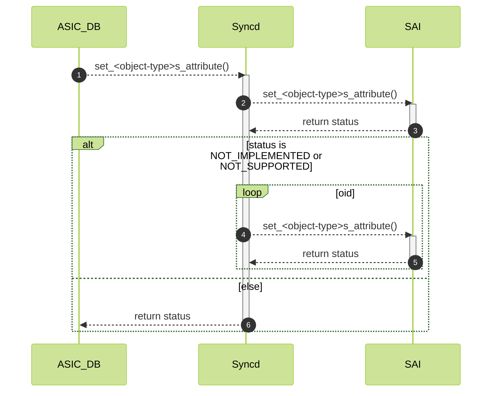
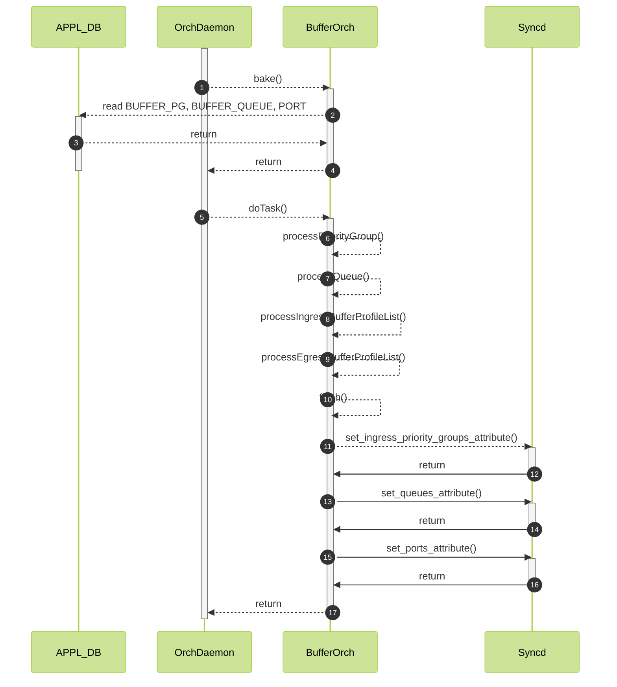

# Buffers Configuration using Bulk API #

## Table of Content

### Revision

### Scope

The scope of the document is utilizing SAI bulk API to speed up buffers configuration in fast and warm reboot.

### Definitions/Abbreviations

| Definitions/Abbreviation | Description                             |
| ------------------------ | --------------------------------------- |
| ASIC                     | Application specific integrated circuit |
| HW                       | Hardware                                |
| SW                       | Software                                |
| SWSS                     | Switch state service                    |
| SYNCD                    | ASIC synchronization service            |
| SAI                      | Switch Abstraction Interface            |
| UT                       | Unit test                               |

### Overview

SONiC starts supporting single ASIC switches with more and more data plane ports available. More HWSKUs with more ports become available, e.g. 256 ports.
This raises a problem of SONiC scaling with the number of ports. Each port has some number of PGs and some number of queues per port depending on ASIC that needs to be configure.
E.g. for 256 port system there could be 2048 PGs and 4096 queues to be configured. Given that there is a strict time requirements for fast-reboot and warm-reboot it is neccesary to
configure all ports and all related port objects in time and keep that part optimized.

Batching is a commonly used approach to speed up processing. It allows to minimize an overhead incured by ASIC Redis channel and allows for more efficient configuration processing at SAI level.
SAI already supports it using bulk APIs. This design adds support for buffers configuration using bulk API as an optimization for fast and warm-reboot.

### Requirements

- Utilize bulk API for buffers configuration to improve configuration performance in fast and warm-reboot
- Support both static and dynamic buffer model
- Fallback to legacy per object API if SAI vendor does not implement or support bulk API

### Restrictions/Limitations

Buffer configuration in bulk is going to be restricted to fast and warm-boot only. In cold boot in dynamic mode the buffer configuration is generated during boot time and the APPL_DB
is filled gradually. In this case, there's no practical way to bulk all configuration together, therefore in cold boot orchagent behaves exactly as today.

In fast-reboot and warm-reboot, APPL_DB is already filled with buffer configuration saved from previous boot. This configuration is read all at once in ```bake()``` giving us the oportunity to batch configuration togather to syncd.

### SAI API

APIs that are available as of 1.15:

| API | Attribute(s) |
|-----|--------------|
| set_ports_attribute | SAI_PORT_ATTR_QOS_INGRESS_BUFFER_PROFILE_LIST, SAI_PORT_ATTR_QOS_EGRESS_BUFFER_PROFILE_LIST |
| set_ingress_priority_groups_attribute | SAI_INGRESS_PRIORITY_GROUP_ATTR_BUFFER_PROFILE |
| set_queues_attribute | SAI_QUEUE_ATTR_BUFFER_PROFILE_ID |

### Architecture Design

N/A

### High-Level Design

#### Syncd

Syncd's ```Syncd::processBulkOidSet``` needs to be extended to support ```SAI_COMMON_API_BULK_SET``` in the same way ```SAI_COMMON_API_BULK_CREATE``` is implemented with a fallback to non-bulk API:

##### Figure 1. Syncd Bulk Set Flow



#### BufferOrch

BufferOrch is design to process and execute configuration one by one. In order to simplify the design and code implementation all of the existing BufferOrch buisness logic needs to be preserved. However, instead of calling to SAI API directly BufferOrch will call to the ```BulkContext``` struct.

The ```BulkContext``` can be configured to execute API immidiatelly for cold boot and record API call for fast and warm boot.
At the end of fast or warm boot ```BufferOrch``` will call ```BulkContext``` flush to combine all API calls into a single SAI bulk API call.

This design should be very similar to ```RouteOrch``` bulk usage design.

Bulk API spec:

```c++
/**
 * @brief Bulk objects set attributes.
 *
 * @param[in] object_count Number of objects to set on attribute
 * @param[in] object_id List of object ids
 * @param[in] attr_list List of attributes for every object, one per object.
 * @param[in] mode Bulk operation error handling mode.
 * @param[out] object_statuses List of status for every object. Caller needs to allocate the buffer.
 *
 * @return #SAI_STATUS_SUCCESS when set attributes on all objects succeeded or
 * #SAI_STATUS_FAILURE when any of the objects fails to set attribute. When
 * there is failure, Caller is expected to go through the list of returned
 * statuses to find out which fails and which succeeds.
 */
typedef sai_status_t (*sai_bulk_object_set_attribute_fn)(
        _In_ uint32_t object_count,
        _In_ const sai_object_id_t *object_id,
        _In_ const sai_attribute_t *attr_list,
        _In_ sai_bulk_op_error_mode_t mode,
        _Out_ sai_status_t *object_statuses);
```

The ```BulkContext``` is to be defined with the following data:

```c++
struct BulkContext
{
    std::vector<sai_object_id_t> oid;
    std::vector<sai_status_t> statuses;
    std::vector<SaiAttrWrapper> attr;
};
```

The data is organized in rows, where each column represents a configuration for single OID. This data structure alignes with SAI Bulk API definition.

#### BufferOrch Error Handling

No change for cold boot. In fast and warm boot, the bulk API *must* succeed, if an error occurs it causes warm restore validation failure. Therefore ```BulkContext``` does not care about ```mode``` parameter and will check single return code returned by bulk call. Orchagent will exit on error.


##### Figure 2. BufferOrch Fast/Warm Boot Flow


### Configuration and management
N/A

#### Manifest (if the feature is an Application Extension)
N/A

#### CLI/YANG model Enhancements
N/A

#### Config DB Enhancements
N/A

### Warmboot and Fastboot Design Impact

This design optimizes buffers configuration during warm-boot and fast-boot.

TODO: give time improvement data on VS.

### Memory Consumption
Batching implies increased memory usage in orchagent. The increased memory usage is relevant only for warm and fast boot flows where bulk API is utilized. Batch buffer for PG and QUEUE is using at most ```N * (number_of_pgs_per_port + number_of_queues_per_port) * sizeof(sai_attribute_t)``` additional bytes. (TODO: for port buffer lists)

### Testing Requirements/Design

- Regression testing
- Warmboot/fastboot downtime testing

#### Unit Test cases

- Existing buffer configuration UT
- UT

#### System Test cases

- warm-reboot
- fast-reboot

### Open/Action items - if any
