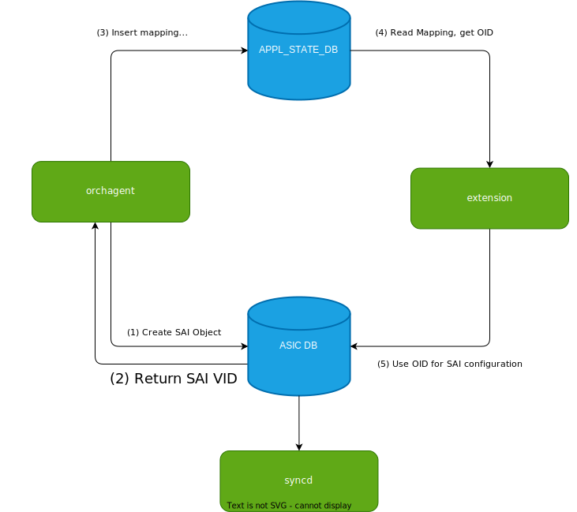

<!-- omit in toc -->
# OID Mapper #

<!-- omit in toc -->
## Table of Content

- [Overview](#overview)
- [Requirements](#requirements)
- [Architecture Design](#architecture-design)
- [High-Level Design](#high-level-design)
- [SAI API](#sai-api)
- [Configuration and management](#configuration-and-management)
	- [Manifest (if the feature is an Application Extension)](#manifest-if-the-feature-is-an-application-extension)
	- [CLI/YANG model Enhancements](#cliyang-model-enhancements)
	- [Config DB Enhancements](#config-db-enhancements)
- [Warmboot and Fastboot Design Impact](#warmboot-and-fastboot-design-impact)
- [Restrictions/Limitations](#restrictionslimitations)
- [Testing Requirements/Design](#testing-requirementsdesign)
	- [Unit Test cases](#unit-test-cases)
	- [System Test cases](#system-test-cases)
- [Open/Action items - if any](#openaction-items---if-any)

<!-- omit in toc -->
### Revision

<!-- omit in toc -->
### Scope

This document describes the high-level design of creating a mapping of CFG_DB/APPL_DB keys to SAIRedis VID and reverse mapping.

<!-- omit in toc -->
### Definitions/Abbreviations

| Definitions/Abbreviation | Description                                |
|--------------------------|--------------------------------------------|
| API                      | Application Programmable Interface         |
| ASIC_DB | ASIC Database         |
| APPL_DB | Application Database         |
| CFG_DB | Configuration Database         |
| APPL_STATE_DB | Application State Database         |
| OID                      | SAI object identifier |
| VID                      | SAIRedis Virtual object identifier |
| RID                      | SAI Real object identifier |
| SAI                      | Switch Abstraction Interface               |
| ACL                      | Access Control List                        |

### Overview

This document proposes two new tables ```APPL_KEY_TO_OID``` and ```OID_TO_APPL_KEY``` in ```APPL_STATE_DB``` that holds mapping between CFG_DB/APPL_DB keys and SAIRedis VID.
In order to interact with mapping an API class ```OidMapper``` is added to SWSS infrastructure.

There are two main use cases for this mapping. The first one, presented on the figure 1, allows an external application create perform SAI configuration based on existing objects created by the orchagent, i.e configuring custom ACL mirror rule with an mirror session already created by the user. While this infrastructure allows for such extensibility, this is just a step towards it.

<!-- omit in toc -->
###### Figure 1. Use case 1

<p align=center>

</p>


Another use case, involves receiving events/notifications from the lower layers by an external application and beeing able to translate an OID attached with an event to a table and key.

<!-- omit in toc -->
###### Figure 2. Use case 2

<p align=center>

</p>

### Requirements

- OidMapper shall provide a way to record a mapping between APPL/CFG DB key and corresponding SAI OID
- OidMapper component shall be created and used by SWSS Orch Agents (OA) for mapping keys used in APP DB to OID of objects created by SAIRedis
- OidMapper shall provide an API to access to the APP_KEY_TO_OID_TABLE in APPL STATE DB
- Reference to OidMapper object shall be embedded by OA's per need
- OidMapper and its API shall be accessible from extension applications
- OidMapper shall support the following APIs:
  - ```set``` - Sets oid for the given key
  - ```get``` - Gets oid for the given key
  - ```erase``` - Erases oid for the given key
  - ```exists``` - Checks whether OID mapping exists for the given key
  - ```getKeyByOid``` - Get CFG_DB/APPL_DB table and key by SAI OID

### Architecture Design

In order to have both forward and back mapping, two new flat maps in ```APPL_STATE_DB``` are added - ```APPL_KEY_TO_OID``` and ```OID_TO_APPL_KEY``` by example of ```ASIC_DB```'s ```RIDTOVID``` and ```VIDTORID``` tables.

The key for ```APPL_KEY_TO_OID``` is chosen to be a tuple of *table name*, *SAI objec type* and *key name*. Having the *table name* in a key allows for multiple orch's produce same SAI object types from different CFG DB or APPL DB tables.
For instance, PBH create ACL entries as well as ACL orch does, the existance of a *table name* in the key allows to differentiate between rules created by PBH from *PBH_RULE* table and rules created by ACL orch from *ACL_RULE* table.
This allows for several different SAI object types beeing associated with a single entry in DB, i.e ACL rule has associated a SAI counters object as well as SAI ACL entry itself.

The case when multiple SAI objects of the same SAI object type are associated with a single key in the DB is rather a special case and is not covered.

The schema:

```
; APPL_KEY_TO_OID table

key 	= table_name:sai_object_type:key_name
value   = serialized_sai_oid
```

```
; OID_TO_APPL_KEY

key		= serialized_sai_oid
value   = table_name:key_name
```

Example:

```
127.0.0.1:6379[14]> hgetall APPL_KEY_TO_OID
1) "PORT:SAI_OBJECT_TYPE_PORT:Ethernet0"
2) "oid:0x100000000090c"
3) "PORT:SAI_OBJECT_TYPE_PORT:Ethernet4"
4) "oid:0x100000000090d"
```

```
127.0.0.1:6379[14]> hgetall OID_TO_APPL_KEY
1) "oid:0x100000000090c"
2) "PORT:Ethernet0"
3) "oid:0x100000000090d"
4) "PORT:Ethernet4"
```

### High-Level Design

In order for ```OidMapper``` to be used by multiple projects, it will be a part of a library ```swss-orch-common```.

An ```OidMapper``` class is added to ```sonic-swss/oidmapper``` and is compiled as separate shared library build target ```swss-orch-common```.

An ```OidMapper``` API:

```c++
namespace swss {

/**
 * @brief OidMapper provides an API to interact with APPL_KEY_TO_OID in the database that
 *        holds mapping between CFG_DB/APPL_DB keys and SAI OID.
 */
class OidMapper
{
public:
    /**
     * @brief Key in the APPL_KEY_TO_OID table
     */
    struct Key
    {
		std::string tableName;
        sai_object_type_t objectType {SAI_OBJECT_TYPE_NULL};
        std::string keyName;
    };

   /**
    * @brief Construct OidMapper from APPL_STATE_DB connector
    *
    * @param applStateDb Reference to swss::DBConnector object
    */
    OidMapper(swss::DBConnector& applStateDb);

    /**
     * @brief Sets oid for the given key.
     *
     * @param key Key to set
     * @param oid Oid to set
     * @return bool True if key was successfully inserted
     */
    bool set(_In_ const Key& key, _In_ sai_object_id_t oid);

    /**
     * @brief Gets oid for the given key.
     *
     * @param key Key to find
     * @return sai_object_id_t SAI OID if key found or SAI_NULL_OBJECT_ID
     */
    sai_object_id_t get(_In_ const Key& key);

    /**
     * @brief Get CFG_DB/APPL_DB table and key by SAI OID
     *
     * @param oid SAI OID for find
     * @return std::pair<std::string, std::string> Table name and key name
     */
    std::pair<std::string, std::string> getKeyByOID(_In_ sai_object_id_t oid);

    /**
     * @brief Erases oid for the given key.
     *
     * @param key Key to erase
     */
    void erase(_In_ const Key& key);

    /**
     * @brief Checks whether OID mapping exists for the given key.
     *
     * @param key Key to find
     * @return bool True if exists, otherwise false
     */
    bool exists(_In_ const Key& key);
};

}
```

### SAI API

N/A

### Configuration and management

N/A

#### Manifest (if the feature is an Application Extension)

N/A

#### CLI/YANG model Enhancements

N/A

#### Config DB Enhancements

N/A

### Warmboot and Fastboot Design Impact

SAIRedis VID might change across warm reboot. Thus, it is required that ```APPL_KEY_TO_OID``` and ```OID_TO_APPL_KEY``` in ```APPL_STATE_DB``` are cleaned up prior to SWSS warm starting in ```swss.sh``` script.

No fast-reboot impact.

### Restrictions/Limitations

The case when multiple SAI objects of the same SAI object type are associated with a single key in the DB is rather a special case and is not covered.

### Testing Requirements/Design

Unit testing is required and no system testing is needed till some Orch is starting to use this infrastructure. When an Orch is using that infrastructure a corresponding VS tests shall be added.

#### Unit Test cases

Google test UT shall be implemented to cover ```OidMapper``` API functionality:

- Check for non-existing objects in the map "PORT|Ethernet0", "ACL_RULE|DATAACL|RULE0" and verify ```exists``` API returns false
- Check that for same keys above ```get``` API returns ```SAI_OBJECT_ID_NULL```
- Set these keys with some OIDs using ```set``` API
- Call ```exists``` API on thise keys and verify it returns true for both
- Perform ```get``` on those keys and verify same OIDs are returned
- Call ```getKeyByOid``` passing those OIDs that were set and verify "PORT|Ethernet0" and "ACL_RULE|DATAACL|RULE0" are returned

#### System Test cases

N/A

### Open/Action items - if any
