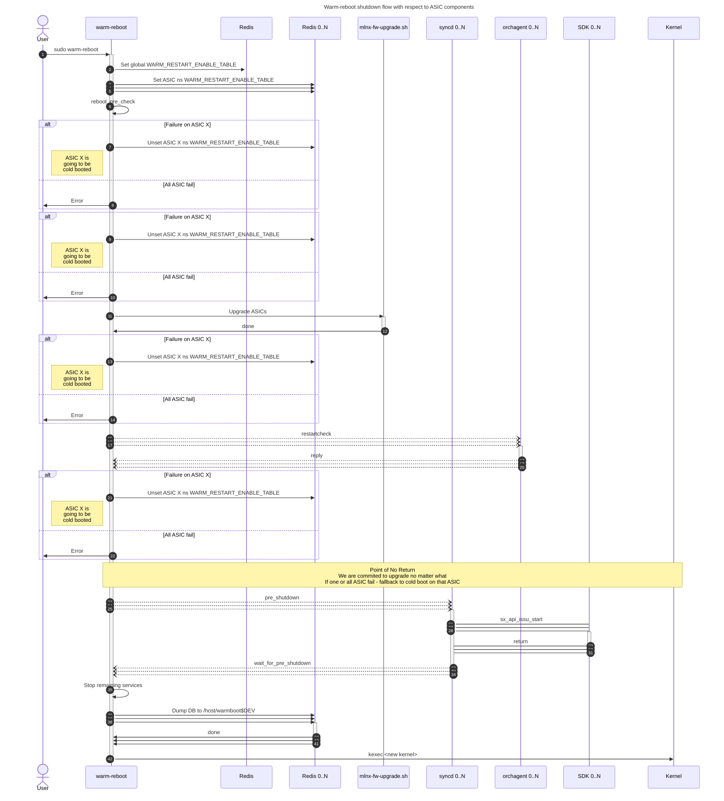
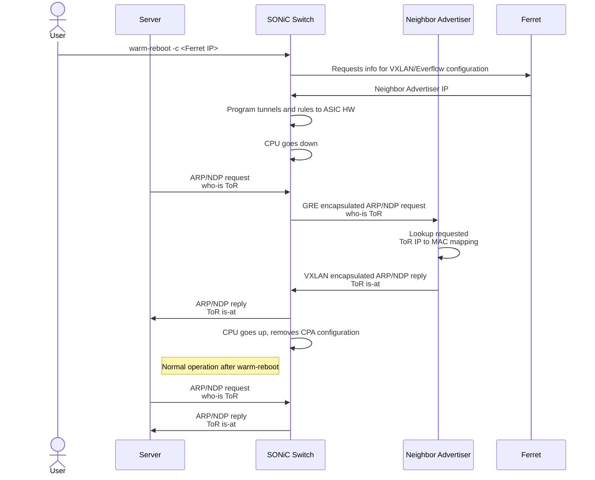
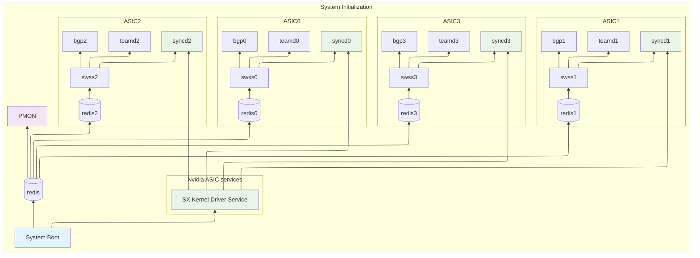
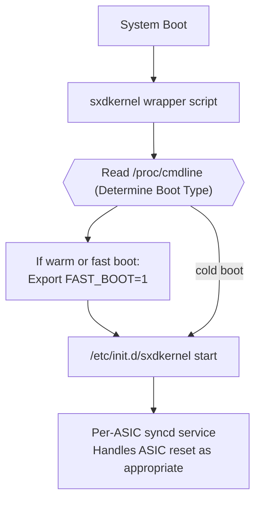
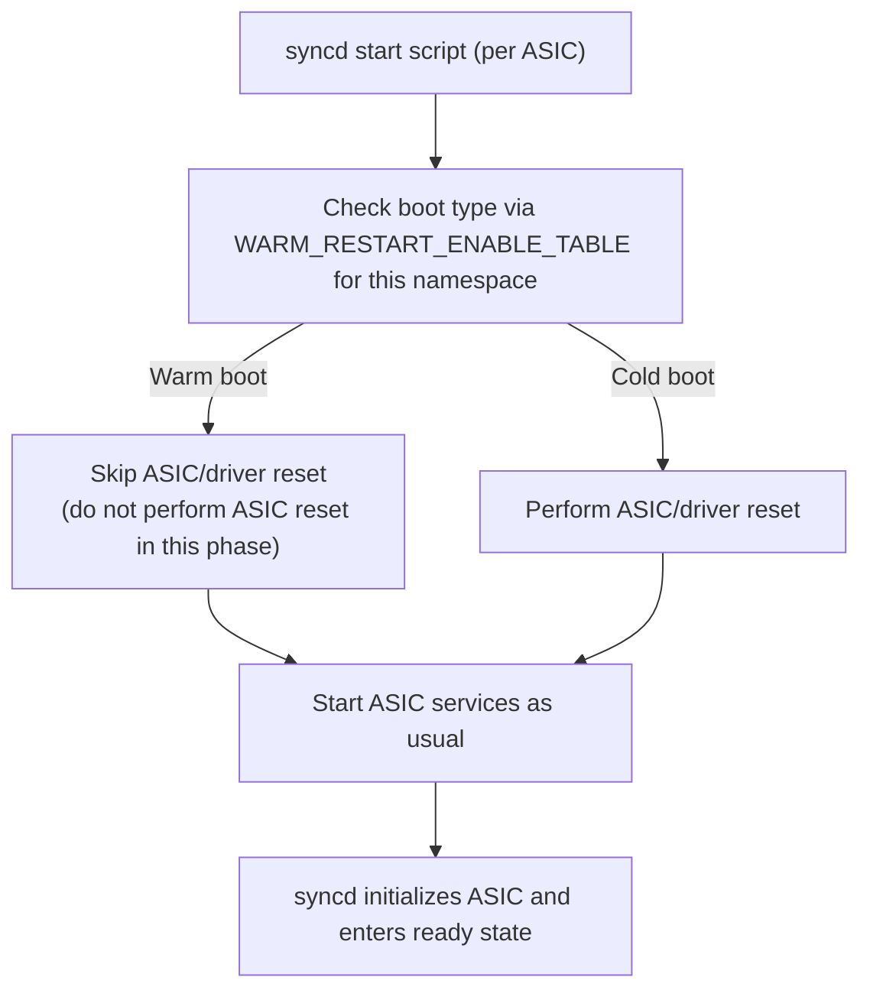
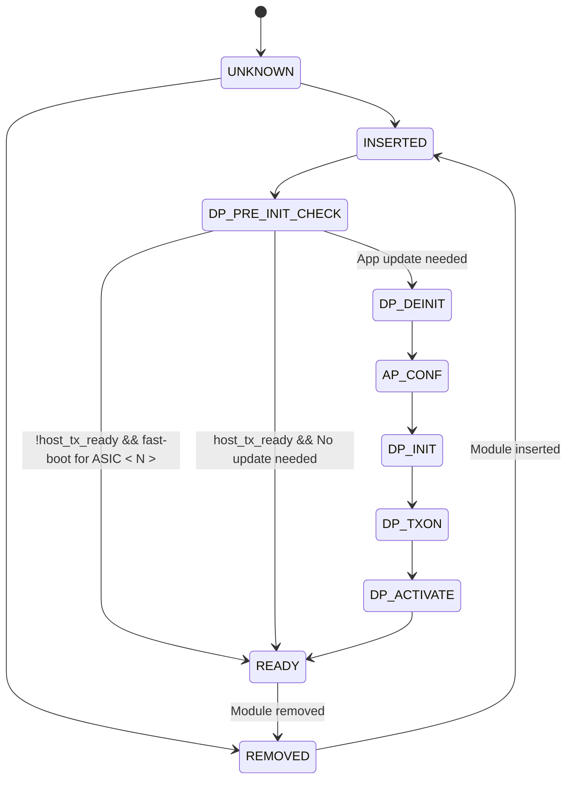
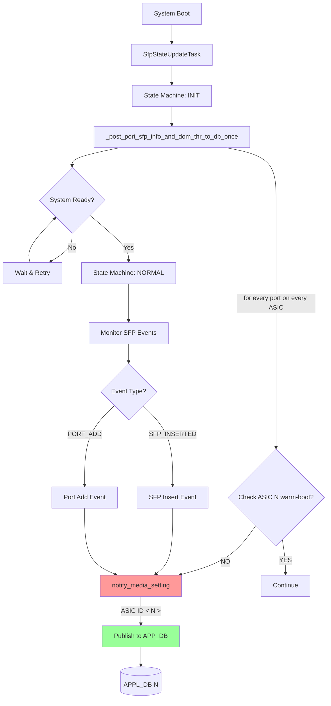
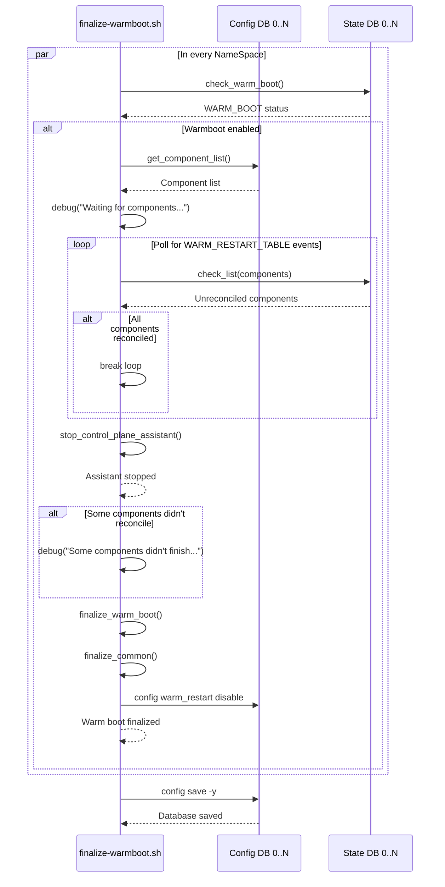

# Multi-ASIC warm-boot #

## Table of Content 

### 1. Revision  

### 2. Scope  

- All firmware, SDKs, and drivers deployed on the system must be aligned to the same version in multi-ASIC environments.
- Multi-ASIC systems can feature complex internal topologies, including both *frontend* and *backend* ASICs, where backend ASICs provide interconnect between frontend ASICs. However, all ASICs in Nvidia Multi-ASIC systems are *frontend* ASICs only, with no internal interconnect. As a result, this document focuses exclusively on warmboot support for Multi-ASIC topologies composed solely of *frontend* ASICs, as Nvidia platforms do not support or test other configurations.
- The primary use case addressed is the deployment of these systems as Top-of-Rack (ToR) devices.
- In multi-ASIC systems, the presence of multiple ASICs increases the potential for failures during ISSU operations. The solution must be robust enough to tolerate failures in one or more ASICs, ensuring that the upgrade process can still be completed successfully without compromising the overall system functionality.
- Single service warm-restart or single ASIC warm-restart is out of scope.

### 3. Definitions/Abbreviations 

### 4. Overview 

The purpose of this section is to give an overview of high-level design document and its architecture implementation in SONiC. 

- All firmware, SDKs, and drivers deployed on the system must be aligned to the same version in multi-ASIC environments.
- The warm-reboot process in SONiC for multi-ASIC platforms follows the same principles as single-ASIC systems, but requires explicit synchronization points within the NOS to coordinate state transitions across all ASICs.

### 5. Requirements

This section list out all the requirements for the HLD coverage and exemptions (not supported) if any for this design.

### 6. Architecture Design 

This section covers the changes that are required in the SONiC architecture. In general, it is expected that the current architecture is not changed.
This section should explain how the new feature/enhancement (module/sub-module) fits in the existing architecture. 

If this feature is a SONiC Application Extension mention which changes (if any) needed in the Application Extension infrastructure to support new feature.

### 7. High-Level Design 

## Warmboot state

To successfully perform a warm reboot, the switch must preserve certain pre-reboot state information. This includes a Redis database snapshot, LAG (Link Aggregation Group) states, saved PDUs, and other relevant data. All such information is stored under the `/host/warmboot/` directory.

In a multi-ASIC system, each namespace is responsible for saving its own warmboot state under `/host/warmboot$DEV`, where `$DEV` is either empty (for the global namespace) or set to the ASIC number for each ASIC-specific namespace. In single-ASIC systems, `$DEV` remains empty, so the path does not change.

To ensure that each container has access to the appropriate warmboot state, the host directory `/host/warmboot$DEV` is mounted into the container at `/var/warmboot/`. This approach allows each container to read and write its own warmboot namespace specific data independently.

The directory mapping is performed as follows:

```
  -v /host/warmboot$DEV:/var/warmboot/
```

As a result, each container operates within its designated ASIC-specific or global directory. Applications inside the container do not require any modifications, as they continue to access warmboot data through the `/var/warmboot/` alias.

Example:

```
/host/warmboot/
└── dump.rdb
/host/warmboot0/
├── dump.rdb
├── sai-dump
└── teamd
    ├── Ethernet0
    └── PortChannel101
/host/warmboot1/
├── dump.rdb
├── sai-dump
└── teamd
    ├── Ethernet512
    └── PortChannel102
...
```

**Affected components**:
  - sonic-buildimage: docker_image_ctl.j2


### CONFIG_DB

#### WARM_RESTART

This table defines configuration parameters for the warm reboot process, such as timers for neighsyncd, teamd, and BGP. During startup, the device may enter transitional states that do not reflect the final network state. Timers delay disruptive actions until the control plane has converged. When a timer expires, the corresponding application begins its reconciliation process, unless other conditions are met (e.g., BGP receives an EoR marker).

These parameters typically use default values in testing, but can be adjusted for specific network requirements. Each application reads its timer values from Redis within its own namespace. Because these settings are ASIC-specific, they are stored separately in each namespace database to ensure applications access the correct configuration.


In multi-ASIC systems, the CLI has been enhanced to automatically configure the CONFIG_DB within each ASIC namespace. This ensures that timer settings remain consistent across all ASICs, providing symmetric warm restart behavior throughout the device.

config command:
```
admin@dut:~# config warm_restart neighsyncd_timer 180
```

**NOTE**: If future requirements call for configuring warm restart timers on a per-ASIC basis, the CLI can be enhanced with a `-n` or `--namespace` option to support this functionality. At present, the recommended approach is to maintain symmetric timer settings across all ASICs for consistency.

### STATE_DB

#### WARM_RESTART_ENABLE_TABLE

The indicator for an ongoing warm reboot is stored in the `WARM_RESTART_ENABLE_TABLE` within the STATE_DB. Applications check this flag to determine whether the current boot mode is a warm boot. Since each application connects to the Redis database within its own namespace, the flag must be set individually for every namespace undergoing a warm reboot.

There are dedicated CLI commands—primarily intended for use by the `warm-reboot` script rather than direct user interaction—that read from and write to this table.

To support multi-ASIC systems, the CLI has been extended with `-n` or `--namespace` options, allowing operations to target a specific namespace.

config command:
```
admin@dut:~# config warm_restart enable -n asic0
```

show command:
```
admin@dut:~# show warm_restart config -n asic0
name    enable    timer_name    timer_duration    eoiu_enable
------  --------  ------------  ----------------  -------------
system  true      NULL          NULL              NULL
```

#### WARM_RESTART_TABLE

SONiC monitors the progress of warm restarts using the `WARM_RESTART_TABLE` in the STATE_DB. Each application that participates in warm restart registers itself in this table, storing its current restart count and the state of its warm boot state machine. Every entry in the table represents a specific application.

To provide better visibility in multi-ASIC systems, the CLI has to be enhanced with `-n` or `--namespace` options. This allows users to display warm restart information for a specific namespace, making it easier to monitor and troubleshoot warm restart status on a per-ASIC basis.

```
admin@sonic:~# show warm_restart state -n asic0
name          restore_count  state
----------  ---------------  --------
gearsyncd                 0
teammgrd                  0
buffermgrd                0  disabled
vrfmgrd                   0  disabled
bgp                       0  disabled
nbrmgrd                   0
orchagent                 0
syncd                     0
fdbsyncd                  0  disabled
coppmgrd                  0
neighsyncd                0
vlanmgrd                  0
teamsyncd                 0
tunnelmgrd                0
portsyncd                 0
intfmgrd                  0  disabled
vxlanmgrd                 0
```

By default, on a Multi-ASIC systems `show warm_restart` command displays all namespaces:

```
admin@sonic:~# show warm_restart state

For namespace global:

name    restore_count    state
------  ---------------  -------

For namespace asic0:

name         restore_count  state
---------  ---------------  ----------
orchagent                1  restored
syncd                    1  reconciled

For namespace asic1:

name         restore_count  state
---------  ---------------  ----------
orchagent                1  restored
syncd                    1  reconciled

For namespace asic2:

name         restore_count  state
---------  ---------------  ----------
orchagent                1  restored
syncd                    1  reconciled

For namespace asic3:

name         restore_count  state
---------  ---------------  ----------
orchagent                1  restored
syncd                    1  reconciled
```

**Affected components**:
  - sonic-utilities: show/config CLI update

## Warm shutdown

Entrypoint for warmboot is `warm-reboot` command. Same command is used for Multi-ASIC system to initiate warm reboot of all the ASICs.

This script has both global operations as well as per ASIC operations to perform.

Changes to the script:
 - The script maintains a list of ASIC IDs to operate on. Every ASIC specific operation will be done in parallel for every ASIC in a list. Single ASIC code path is a special case of Multi-ASIC where the list size is 1.
 - All per-ASIC shutdown operations are executed concurrently to minimize overall shutdown duration and maximize efficiency.




The `lag_keepalive.py` script is responsible for continuously sending LACP PDUs on behalf of teamd when teamd is temporarily stopped during a warm reboot. It is launched in the background by the warm-reboot script and operates throughout the entire reboot process to maintain LAG connectivity. For multi-ASIC systems, this script should be updated to run a separate instance for each ASIC namespace.

The `teamd_increase_retry_count.py` script, which is used to configure a larger LACP timeout, must also be updated to support execution within a specified namespace in multi-ASIC environments.

#### Logging

For easier debugging and traceability, every operation or log message associated with a specific ASIC namespace should be clearly prefixed with its namespace identifier (e.g., "asic0", "asic1", etc.).

#### Failure handling

SONiC must be resilient during the upgrade process, allowing the upgrade to proceed even if one or more ASICs encounter failures (for example, during firmware upgrade or the `sx_api_issu_start` phase).

**NOTE**: If failures occur before the point of no return, the system design allows either aborting the entire operation or proceeding by cold booting just the affected ASICs, based on user input. This approach minimizes disruption and allows users an opportunity to address issues. According to architecture guidelines, the default behavior is to cold boot only the failed ASICs while continuing the warm boot process on the remaining healthy ASICs.

The table below summarizes failure handling for key operations with respect to ASIC failure:

| ASIC Operation                | Single-ASIC Handling                                                                 | Multi-ASIC Handling                                                                                                 |
|-------------------------------|--------------------------------------------------------------------------------------|---------------------------------------------------------------------------------------------------------------------|
| Pre-reboot DB checks | Abort operation | Cold reboot failing ASIC  |
| Firmware (FW) Upgrade         | Abort operation | Considered as critical failure. ASIC will not start after a reboot |
| Orchagent Restart Check       | Abort operation                                         | Cold reboot failing ASIC      |
| Syncd Pre-shutdown (ISSU Start) | Failure is ignored | Failure is ignored        |

If all ASICs fail during the process, the failure handling procedure is identical to that of a single-ASIC system.

#### Control plane assistant

This functionality involves proprietarry MSFT service called Ferret and is not covered in this HLD
<!-- 
<details>
<summary>CPA details</sumary>

The control plane assistant is a mechanism that leverages external services to temporarily handle ARP (Address Resolution Protocol) and NDP (Neighbor Discovery Protocol) requests from connected servers during the device's reboot process. When the switch is undergoing a warm reboot and its control plane is unavailable, the control plane assistant responds to these network discovery requests on behalf of the switch. This ensures that network connectivity and address resolution for servers are maintained without interruption, minimizing downtime and preventing packet loss during the reboot window.

ARP/NDP flow during warm-reboot:



- Example Ferret Requesst JSON Payload:

```json
{
    "respondingSchemes": {
        "durationInSec": 300
    },
    "switchInfo": {
        "hwSku": "SKUNAME",
        "ipv4Addr": "10.1.0.32",
        "ipv6Addr": "fc00:1::32",
        "name": "SONIC01"
    },
    "vlanInterfaces": [
        {
            "ipv4AddrMappings": [
                {
                    "ipAddr": "192.168.0.1",
                    "ipPrefixLen": "32",
                    "macAddr": "1c:34:da:1d:40:00"
                },
                {
                    "ipAddr": "192.169.0.1",
                    "ipPrefixLen": "32",
                    "macAddr": "1c:34:da:1d:40:00"
                }
            ],
            "ipv6AddrMappings": [
                {
                    "ipAddr": "fc02:1000::1",
                    "ipPrefixLen": "128",
                    "macAddr": "1c:34:da:1d:40:00"
                },
                {
                    "ipAddr": "fe80::1e34:daff:fe1d:4000",
                    "ipPrefixLen": "128",
                    "macAddr": "1c:34:da:1d:40:00"
                }
            ],
            "vlanId": "1000",
            "vxlanId": "1000"
        }
    ]
}
```

- Example ASIC Configuration Generated:

```json
{
    "VXLAN_TUNNEL": {
        "neigh_adv": {
            "dst_ip": "192.168.8.1",
            "src_ip": "10.1.0.32"
        }
    },
    "VXLAN_TUNNEL_MAP": {
        "neigh_adv|map_1": {
            "vlan": "Vlan1000",
            "vni": "1000"
        }
    },
    "ACL_RULE": {
        "EVERFLOWV6|rule_nd": {
            "ICMPV6_TYPE": "135",
            "PRIORITY": "8887",
            "mirror_action": "neighbor_advertiser"
        },
        "EVERFLOW|rule_arp": {
            "PRIORITY": "8888",
            "ether_type": "2054",
            "mirror_action": "neighbor_advertiser"
        }
    }
}
```

</details> -->

**Affected components**:
  - sonic-utilities
    - warm-reboot
    - check_db_integrity
    - lag_keepalive
    - teamd_retry_count

## Warm startup

#### High-Level system boot flow for Multi-ASIC system



### Database

During system boot, each database instance restores its state by loading the corresponding `/host/warmboot$DEV/dump.rdb` snapshot file, which was saved during the previous shutdown. This ensures that all data present before the reboot is reloaded into the database. After loading the snapshot, the `db_migrator.py` script runs for each database instance to update the schema as needed. The restored data includes the `WARM_RESTART_ENABLE_TABLE` and `WARM_RESTART_TABLE` from STATE_DB, allowing every application within its namespace to detect warm boot mode and access the preserved state required for a successful warm boot.

##### Failure handling

If the `dump.rdb` file is missing, an empty file is generated and loaded, resulting in an empty database for that ASIC namespace. Consequently, the affected ASIC and its applications will perform a cold boot.


### Nvidia Firmware Manager Service

The Nvidia Firmware Manager Service executes at every system boot to verify and update the firmware (FW) on all ASICs. During a cold boot, its primary responsibility is to upgrade the firmware across all ASICs as needed.

In a typical warm boot scenario, firmware upgrades are not performed, since the firmware should already be up-to-date.

FW upgrade service modified to execute conditionally using `ExecCond`:

```ini
[Unit]
Description=Nvidia Firmware Manager Service
...

[Service]
ExecCond=/bin/grep -qv '\<SONIC_BOOT_TYPE=fastfast\>' /proc/cmdline
ExecStart=/usr/bin/mlnx-fw-manager --verbose --clear-semaphore
...
```

In case of Nvidia warm-boot the FW upgrade service is skipped and the dependent services are started immidiatelly to not block further execution.

#### SX Kernel Driver Service

The `sxdkernel` service and associated SDK drivers are initialized at this stage. Importantly, ASIC reset operations must not occur here, regardless of whether the system is performing a cold or warm boot. This is deferred to the per-ASIC syncd service start script.

A wrapper script calling `/etc/init.d/sxdkernel start` should determine the boot type via `/proc/cmdline` and export `FAST_BOOT=1` environment variable to tell the driver to skip ASICs reset in this phase.


*SXD kernel service and ASIC reset sequence flow for cold/warm boot.*



### ASIC services stack

Followed by database instance for that namespace, SWSS, syncd, teamd and bgp containers start. The start flows of the ASIC services in isolation are exactly the same as in a single ASIC scenario when viewed from the perspective of that ASIC. No ASIC interdependencies exist. Each application performs it's own logc within it's working namespace without knowledge of other ASICs or any synchronization. Applications are isolated from each other and concerned only about the ASIC they work within.


* Syncd

Each syncd process starts as usual and performs the same flow as on a single-ASIC system, because each syncd instance is concerned only with its associated ASIC.

When warm-boot is detected for that namespace the ASIC reset is omited:



At this stage, `syncd.sh` should determine the boot type by reading the corresponding flag from the database (`WARM_RESTART_ENABLE_TABLE`) rather than relying on `/proc/cmdline`. Since all necessary DB instances are already up, this approach accurately reflects the current boot state for each ASIC, ensuring correct handling of warm boot, cold boot, or fallback scenarios.

**Affected components**: syncd.sh

* SWSS

Each swss process (portsyncd, orchagent, etc.) starts as usual and performs the same flow as on a single-ASIC system, because each swss process is concerned only with its associated ASIC.

* Neighbor reconciliation

In a multi-ASIC system, neighbor reconciliation is isolated per ASIC and performed independently on each ASIC. The process on one ASIC does not affect or depend on the others.

* Teamd

In a multi-ASIC system, each LAG (Link Aggregation Group) on every ASIC undergoes the warm-reboot process independently, ensuring that the reboot of one ASIC does not interfere with others. 

* BGP

In a multi-ASIC system, each ASIC operates independently, and BGP processes on each ASIC will perform warm boot independently of one another. This means that a warm reboot of BGP on one ASIC does not impact the BGP sessions or warm boot process on other ASICs. Each BGP instance manages its own state and reconvergence, ensuring that the warm boot procedure is isolated per ASIC and does not introduce cross-ASIC dependencies or disruptions.

##### Failure handling

Thanks to each namespace beein isolated, a startup failure in any ASIC-specific application inside either SWSS, syncd, teamd, or BGP — remains confined to that particular ASIC. Such failures do not impact the operation of other ASICs. Error handling for these scenarios is identical to that of a single-ASIC system or health event handling described previously: the affected application will crash or exit, and if automatic restart is enabled (which is the default), the ASIC services stack will be restarted independently for that ASIC.

**Affected components**:
  - No changes required in sonic-swss/sonic-sairedis

### PMON

PMON operates as a single instance container in a multi-ASIC environment. Its primary role is to manage global platform resources such as power supply units (PSUs), fans, LEDs, sensors, and transceivers connected to the ASICs. For CMIS-managed modules, PMON is responsible for handling the CMIS state machine and generating ASIC-specific Signal Integrity (SI) configurations, which it publishes to the APPL_DB.

While PMON’s management of global platform components remains consistent with single-ASIC systems, its module handling logic must be enhanced to support independent warm-reboot and cold boot recovery for each ASIC. This ensures robust operation even if an individual ASIC experiences a failure during boot or upgrade.

In Nvidia multi-ASIC systems, there are 64 CPO modules. The underlying Nvidia software stack presents each CPO as a virtual module (vModule) with 32 lanes. This virtual module abstraction provides a standardized CMIS interface to upper layers, enabling straightforward, modular management for the link manager.

In a warm-reboot scenario the ASIC is not reset and the vModule is not reset.

In a multi-ASIC scenario, `xcvrd` must maintain awareness of the port-to-ASIC ID mapping to correctly manage multiple ASICs independently. The daemon requires updates to check for warm boot status on a per-ASIC basis rather than relying on a global `WARM_RESTART_ENABLE_TABLE` flag, ensuring that each ASIC's warm boot state is evaluated individually.

##### Xcvrd CmisManagerTask

In a warm-boot scenario, the module initializes in a ready state with the DataPath already activated. The lower layer keeps host TX readiness at this point. Under these conditions, the state machine transitions directly to the READY state without requiring a re-init.

###### CmisManagerTask CMIS state diagram:



###### Failure handling

In failure scenarios where an ASIC undergoes a cold boot (whether due to shutdown failure or an auto-restart triggered cold boot), the `CmisManagerTask` follows the identical execution flow as that of a cold-booted device. The module initialization sequence remains the same as in cold boot due to module reset, ensuring consistent behavior and proper CMIS state machine progression.

**Affected components**:
  - No changes required in xcvrd's CmisManagerTask

##### Xcvrd SfpStateUpdateTask

ASIC-side Signal Integrity (SI) configuration is managed by the SfpStateUpdateTask component. The `notify_media_setting` function is triggered during two scenarios: (1) during task initialization and (2) when SFP insertion events occur or new ports are added to the `PORT_TABLE` as in DPB case.

During warm boot scenarios, SFP insertion events and port table updates are not anticipated, which means SI configuration is exclusively handled during SfpStateUpdateTask initialization. To prevent port flapping, the initialization code path includes a warm boot check for each ASIC <N>. When an ASIC is detected to be in warm boot state, the system avoids overriding existing SI parameters, maintaining link stability during the warm boot process.

###### SfpStateUpdatTask flowchart:



###### Failure handling

In failure scenarios where an ASIC undergoes a cold boot (whether due to shutdown failure or an auto-restart triggered cold boot), the `SfpStateUpdateTask` follows the identical execution flow as that of a cold-booted device, ensuring consistent behavior and proper initialization of Signal Integrity (SI) configuration parameters.

**Affected components**:
  - Update xcvrd's SfpStateUpdateTask to check per-ASIC warm restart flag instead of global

### Global services

All remaining system services are started in the same manner as on a single-ASIC system. No modifications or special handling are necessary for these services in the multi-ASIC environment.

**Affected components**:
  - No changes required 

### Warmboot finalizer

The `warmboot-finalizer.service` is responsible for performing all necessary cleanup actions related to warm boot once the process is complete.
This service monitors the `WARM_RESTART_TABLE` in the STATE_DB of every namespace, waiting until all participating daemons have reached the `reconciled` state.
Once reconciliation is confirmed, it proceeds to disable warm boot by updating the `WARM_RESTART_ENABLE_TABLE` and performs any additional cleanup tasks required to restore the system to its normal operational state. Finally it saves in-memory config on all namespaces.




#### Logging

For easier debugging and traceability, every operation or log message associated with a specific ASIC namespace should be clearly prefixed with its namespace identifier (e.g., "asic0", "asic1", etc.).

**Affected components**:
  - sonic-buildimage: warmboot-finalizer.service 


### 8. SAI API 

This section covers the changes made or new API added in SAI API for implementing this feature. If there is no change in SAI API for HLD feature, it should be explicitly mentioned in this section.
This section should list the SAI APIs/objects used by the design so that silicon vendors can implement the required support in their SAI. Note that the SAI requirements should be discussed with SAI community during the design phase and ensure the required SAI support is implemented along with the feature/enhancement.

### 9. Configuration and management 
This section should have sub-sections for all types of configuration and management related design. Example sub-sections for "CLI" and "Config DB" are given below. Sub-sections related to data models (YANG, REST, gNMI, etc.,) should be added as required.
If there is breaking change which may impact existing platforms, please call out in the design and get platform vendors reviewed. 

#### 9.1. Manifest (if the feature is an Application Extension)

Paste a preliminary manifest in a JSON format.

#### 9.2. CLI/YANG model Enhancements 

#### 9.3. Config DB Enhancements  
		
### 10. Warmboot and Fastboot Design Impact

### Warmboot and Fastboot Performance Impact

### 11. Memory Consumption

### 12. Restrictions/Limitations  

### 13. Testing Requirements/Design  

#### 13.1. Unit Test cases  

#### 13.2. System Test cases

### 14. Open/Action items - if any 

NOTE: All the sections and sub-sections given above are mandatory in the design document. Users can add additional sections/sub-sections if required.
