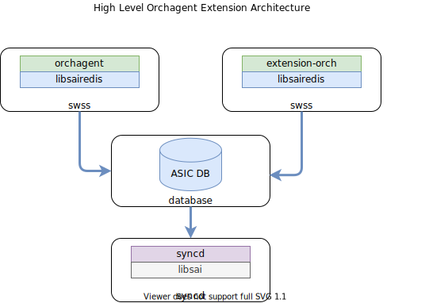
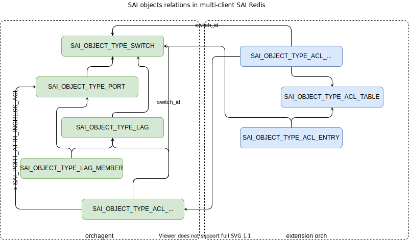
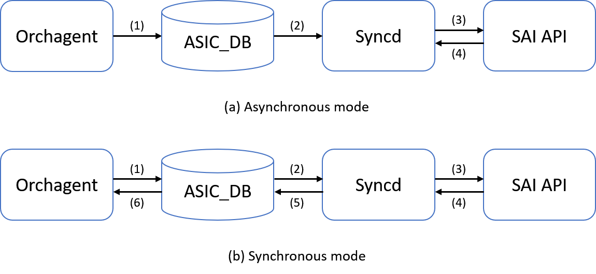
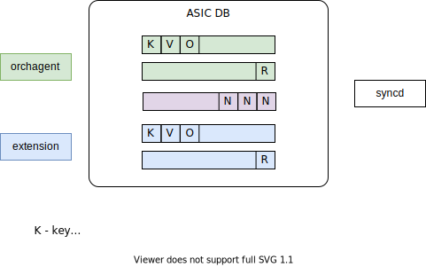

<!-- omit in toc -->
# Orchestration Agent Extensions

<!-- omit in toc -->
#### Rev 0.1

<!-- omit in toc -->
## Table of Content

## List of Figures

### Revision

|  Rev  |  Date   |      Author      | Change Description |
| :---: | :-----: | :--------------: | ------------------ |
|  0.1  | 09/2020 | Stepan Blyshchak | Initial Design     |

### Scope

This document describes the high level design of Orchagent Extension Infrastructure.

### Definitions/Abbreviations

| **Abbreviation** | **Definition**                        |
| ---------------- | ------------------------------------- |
| SONiC            | Software for Open Networking in Cloud |
| DB               | Database                              |
| API              | Application Programming Interface     |
| SAI              | Switch Abstraction Interface          |
| OID              | Object Identifier                     |
| VID              | SAIRedis Virtual Object Identifier    |
| RID              | Real SAI Object Identifier            |

## Overview

<!-- omit in toc -->
### Feature Overview

Orchagent Extension Infrastructure allows external processes to perform SAI programming.

<!-- omit in toc -->
### Motivation

SONiC Application Extension Infrastructure opens a possibility to run 3rd party applications that run in a Docker container.
Although, as of today (202012 release) only orchagent process is allowed to execute SAI Redis API calls.
This document is to addresses this limitation.

### Requirements

- An external process should operate using same API as orchagent does
  - CONFIG_DB, APP_DB, STATE_DB via libswsscommon
  - ASIC_DB via libsairedis
- External process is able to perform SAI quad API for its own objects
- External process is able to use existing objects created by orchagent to create its own
- External process is not able to perform SAI quad API for orchagent managed objects
- From syncd POV there is no difference in objects managed by orchagent or extension process

## Architecture Design

<p align=center>

</p>

#### Figure 1. High Level Orchagent Extension Architecture

<p align=center>

</p>

#### Figure 2. SAI object model in scope of orchagent extensions

## High-Level Design

## SAIRedis IPC

### Redis Based Communication

Redis Based communication between SAIRedis and syncd is implemented using ProducerTable and ConsumerTable SWSS common primitives. This communication is based on queues in PubSub channels in ASIC_DB for sending/receiving requests/responses and notifying about new data in the relevant queue respectively.

Example, request to create VLAN object:

SAIRedis
```
127.0.0.1:6379[1]> LPUSH ASIC_STATE_KEY_VALUE_OP_QUEUE ASIC_STATE:SAI_OBJECT_TYPE_VLAN:oid:0x00000000000001  '{"SAI_VLAN_ATTR_VLAN_ID": 1000}' sSET
127.0.0.1:6379[1]> PUBLISH ASIC_STATE_CHANNEL G
```

SyncD
```
127.0.0.1:6379[1]> SUBSCRIBE ASIC_STATE_CHANNEL
127.0.0.1:6379[1]> LRANGE ASIC_STATE_KEY_VALUE_OP_QUEUE -popsize -1
127.0.0.1:6379[1]> LTRIM ASIC_STATE_KEY_VALUE_OP_QUEUE -(popsize-1)
127.0.0.1:6379[1]> HSET ASIC_STATE:SAI_OBJECT_TYPE_VLAN:oid:0x00000000000001 SAI_VLAN_ATTR_VLAN_ID 1000
```

### Async Mode

In async communication mode get APIs are synchronous. On create, set, remove APIs the client SAIRedis library allocates VID and consumer syncd updates ASIC DB when data is popped from queue. As a result both extension and orchagent can't use the same queue and channel for responses as one process may consume reply designated for another process.

### Sync Mode

In sync communication mode all APIs are synchronous. On create, set, remove APIs the client SAIRedis library allocates VID and ASIC DB is updated by syncd if operation is successful. Client blocks until syncd sends reply back. As a result both extension and orchagent can't use the same queues and channels for requests and responses.

<p align=center>

</p>

#### Figure 3. Synchronous vs Asynchronous SAIRedis

### Notifications

Syncd sends notifications on port operational status changes, learnt FDB, etc. to a Redis PubSub channel, therefore it can be used by multiple consumers at the same time.


<p align=center>

</p>

#### Figure 3. SAIRedis communication mechanism

#### Client Identification

#### SWSS common changes

A new class is introduced in swss common code that implements multi-client synchronous/asynchronous communication using Request/Reply pattern:

```c++
class Requester final
{
public:
    enum Result
    {
        SUCCESS,
        TIMEOUT,
        ERROR
    };

    struct Opts
    {
        bool async {false};
        bool buffered {false};
        int timeout {DEFAULT_REQUEST_TIMEOUT};
        std::string prefix {EMPTY_PREFIX};
        // used to override generated reply channel name
        std::string replyChannel {EMPTY_PREFIX};
    };

    /**
     * @brief Construct Requester object from the DB
     * connection object and tableName.
     *
     * @details
     *
     * @param[in] db DBConnector pointer
     * @param[in] tableName Table name string to use
     * @param[in] opts Options structure, optional
     */
    Requester(DBConnector* db,
              const std::string& tableName,
              Opts opts = Opts{});

    /**
     * @brief Make a request of KeyOpFieldValuesTuple
     *
     * @param[in] req Tuple of key/op/field-value vector as request
     * @param[out] rep Tuple of key/op/field-value vector as reply
     * @return Request result
     */
    Result request(const KeyOpFieldsValuesTuple& req,
                   KeyOpFieldsValuesTuple& rep);

private:
    /* private fields and methods */
};
```

```c++
/**
 * @brief Responder is used to receive
 * KeyOpFieldValues commands sent by the Requester.
 * Implements Selectable interface to use with select.
 */
class Responder final : public RedisSelect
{
public:

    enum Result
    {
        SUCCESS,
        TIMEOUT,
        ERROR
    };

    struct Opts
    {
        bool async {false};
        int popBatchSize {DEFAULT_POP_BATCH_SIZE};
        int pri {1};
        int timeout {DEFAULT_REQUEST_TIMEOUT};
        std::string prefix {EMPTY_PREFIX};
        // used to override generated reply channel name
        std::string replyChannel {EMPTY_PREFIX};
    };

    /**
     * @brief Construct Responder object from the DB
     * connection object and tableName.
     *
     * @details
     *
     * @param[in] db DBConnector pointer
     * @param[in] tableName Table name string to use
     * @param[in] opts Options structure, optional
     */
    Responder(DBConnector* db,
              const std::string& tableName);

    /**
     * @brief Pop request from buffer
     *
     * @param[out] req Tuple of key/op/field-value vector as request
     * @return Responder result
     */
    Result pop(KeyOpFieldsValuesTuple& req);

    /**
     * @brief Send reply to requester that sent request
     *
     * @param[out] req Tuple of key/op/field-value vector as request
     * @return Responder result
     */
    Result reply(const KeyOpFieldsValuesTuple& rep);

private:
    /* private fields and methods */
};
```

This way other SONiC subsystems may benefit from synchronous, asynchronous multi-client communication.

SAIRedis when initializing RedisChannel increments the number of

### ZMQ Based Communication

SAIRedis/Syncd uses Request/Reply ZMQ pattern which already supports multiple clients handling, so ZeroMQChannel/ZeroMQSelectable channel already support needed operation.

TODO: If ipc:// is used the path to socket needs to be shared with another containers, thus exist in a Docker volume.

## SAIRedis State

SAIRedis library keeps internal representation of an ASIC DB state for object validation and object reference counting.
This internal representation is not shared between orchagent and extensions, thus any object related API executed from
extension process will fail in default SAIRedis operation mode if the API is trying to reference an object created by
orchagent or another orchagent extension instance; i.e this could be an API to create a route referencing virtual router
object ID created by orchagent, since virtual router OID is not present in SAIRedis internal state representation this
API will fail on SAIRedis due to OID reference validation.

Another mode for SAIRedis is required and it is required to be enabled by every extension processes.

### SAIRedis external mode

The external mode is meant to be used by extensions which would like to make use of SAI objects owned by another
applications.

This operation mode is enabled by SAIRedis switch attribute set API:

```c
sai_attribute_t attr;
attr.id = SAI_REDIS_SWITCH_ATTR_MODE_EXTERNAL;
attr.value.booldata = true;
sai_status_t status = sai_switch_api->set_switch_attribute(gSwitchId, &attr);
```

Below is overview of CRUD SAI API capabilities. In below section term object means ASIC_STATE table object which can be either SAI object ID or SAI entry (FDB, routes, etc.).

#### Interface Query API

API to be supported in extension context:

- sai_api_initialize
- sai_api_uninitialize
- sai_api_query

#### Object API

SAI Object API:

- sai_query_attribute_capability
- sai_query_attribute_enum_values_capability
- sai_query_stats_capability

This APIs return a constant data (usually?) and are useful for extension to query to determine SAI vendor capabilities.

#### Create API

An extension is allowed to create new objects referencing other objects created by orchagent or other extensions including this one. No special restriction for create operations are done.

#### Remove API

Removing objects is allowed in extension for its own objects.

#### Set API

An extension can execute set operations on its own objects - objects created by this extension. Set operations on objects not owned by this extensions will not pass SAIRedis object validation.

This is in accordance to the architecture of orchagent extension, an extension process is allowed to change only the portion of ASIC state created by the extension. Modifications on ASIC state created by orchagent or other extensions may lead to inconsistent state in orchagent that is hard to recover from.

#### Get API

Get API on objects not owned by extension are generally not supported as may lead to inconsistent state due to similar reasons as set API. The only difference is which process will enter inconsistent state. With set API executed from extension, orchagent will enter inconsistent state, while with get API the extension may enter inconsistent state because there is no guaranty the orchagent will not change the queried object.

Get API for read only attributes are supported. SAIRedis checks if an attribute ID extension is trying to read is read only and passing the object validation. This might be useful in some scenarios like querying CRM stats for extension managed object type on switch object, i.e querying SAI_SWITCH_ATTR_AVAILABLE_SNAT_ENTRY, SAI_SWITCH_ATTR_AVAILABLE_DNAT_ENTRY by NAT extension.

#### Bulk APIs

Same capabilities for extensions are applied to SAI bulk API counterparts.


### Virtual Object OID

#### Global Switch VID

To execute SAI object API it is required to pass a related SAIRedis object VID. The root node of SAI object mode, that
every other objects depend on is a SAI_OBJECT_TYPE_SWITCH. An extension application must
wait till an object VID of type SAI_OBJECT_TYPE_SWITCH is created by an orchagent

### Object Reference Count

## Fast Reboot

## Warm Reboot

### Extension Warm Restart

### SWSS Warm Restart

## Extension API

## Extension Example Snippet

```
const sai_service_method_table_t* const test_services = nullptr;
sai_attribute_t attr{};
sai_object_id_t switchId{};

sai_api_initialize(0, test_services);
sai_api_query(SAI_API_SWITCH, static_cast<void**>(&sai_switch_api));
sai_api_query(SAI_API_PORT, static_cast<void**>(&sai_port_api));

attr.id = SAI_REDIS_SWITCH_ATTR_REDIS_COMMUNICATION_MODE;
attr.value.s32 = SAI_REDIS_COMMUNICATION_MODE_REDIS_SYNC;

// get switch id

auto status = sai_switch_api->set_switch_attribute(0x21000000000000, &attr);
std::cout << "Set communication mode to sync: " << sai_serialize_status(status) << std::endl;
```


# Open items