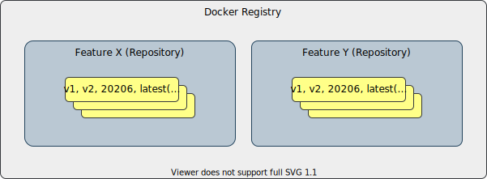

# High Level Design Document

#### Rev 0.1

# Table of Contents

- [High Level Design Document](#high-level-design-document)
      - [Rev 0.1](#rev-01)
- [Table of Contents](#table-of-contents)
- [List of Figures](#list-of-figures)
- [Revision](#revision)
- [About this Manual](#about-this-manual)
- [Scope](#scope)
- [Definitions/Abbreviation](#definitionsabbreviation)
- [Introduction](#introduction)
- [1.1 Feature Overview](#11-feature-overview)
- [1.2 Motivation](#12-motivation)
- [1.3 Requirements](#13-requirements)
  - [Functional requirements](#functional-requirements)
  - [Development Phases](#development-phases)
- [2. Design](#2-design)
- [2.1 Basic concepts](#21-basic-concepts)
- [2.2 Essential SONiC Packages](#22-essential-sonic-packages)
- [2.3 SONiC Package Manager](#23-sonic-package-manager)
- [2.3.1 SONiC Package Database](#231-sonic-package-database)
- [2.3.2 SONiC Package Versioning](#232-sonic-package-versioning)
- [2.3.3 SONIC Base Image Versioning](#233-sonic-base-image-versioning)
- [2.4 SONiC Package Manager Command Line Interface](#24-sonic-package-manager-command-line-interface)
      - [CLI](#cli)
      - [List of packages available](#list-of-packages-available)
      - [Repository management](#repository-management)
      - [Package Installation](#package-installation)
      - [Package Upgrade](#package-upgrade)
- [2.4 Manifest File](#24-manifest-file)
- [2.6 Installation Dependencies](#26-installation-dependencies)
- [2.7 Service File](#27-service-file)
- [2.8 Container management script](#28-container-management-script)
          - [Service start/stop](#service-startstop)
- [2.9 Initial Extension Configuration](#29-initial-extension-configuration)
          - [Manifest file path](#manifest-file-path)
- [2.9 CLI extension](#29-cli-extension)
          - [Example](#example)
          - [Manifest file path](#manifest-file-path-1)
- [2.10 Processes and entry point](#210-processes-and-entry-point)
          - [Manifest file path](#manifest-file-path-2)
- [2.11 SONiC Processes and Docker Statistics Telemetry Support](#211-sonic-processes-and-docker-statistics-telemetry-support)
- [2.12 Monit Configuration](#212-monit-configuration)
- [2.13 Feature Concept Integration](#213-feature-concept-integration)
- [2.14 Multi-DB support](#214-multi-db-support)
- [2.15 Configuration Reload](#215-configuration-reload)
          - [Approach 1](#approach-1)
          - [Approach 2](#approach-2)
- [2.16 Warm/Fast restart](#216-warmfast-restart)
          - [warm-reboot.j2 snippet](#warm-rebootj2-snippet)
          - [Manifest file path](#manifest-file-path-3)
- [2.17 System Dump](#217-system-dump)
          - [Manifest file path](#manifest-file-path-4)
- [2.18 SONiC-2-SONiC upgrade](#218-sonic-2-sonic-upgrade)
          - [Package migration scenarios](#package-migration-scenarios)
- [2.19 Multi-ASIC](#219-multi-asic)
          - [Manifest file path](#manifest-file-path-5)
- [2.20 SONiC Build System](#220-sonic-build-system)
- [Open questions](#open-questions)

# List of Figures
- [Figure 2.1: Basic Concepts](#figure-21-basic-concepts)

# Revision

| Rev |     Date    |       Author            | Change Description                   |
|:---:|:-----------:|:-----------------------:|--------------------------------------|
| 0.1 | 08/2020     | Stepan Blyshchak        | Initial version                      |

# About this Manual

This document provides an overview of the design of implementation of SONiC Application Extension Infrastructure.

# Scope

This document describes the high level design of SONiC Application Extension Infrastructure.

# Definitions/Abbreviation

| **Abbreviation**         | **Definition**                         |
|--------------------------|----------------------------------------|
| SONiC                    | Software for Open Networking in Cloud  |
| DB                       | Database                               |
| API                      | Application Programming Interface      |
| SAI                      | Switch Abstraction Interface           |
| YANG                     | Yet Another Next Generation            |
| JSON                     | Java Script Object Notation            |
| XML                      | eXtensible Markup Language             |
| gNMI                     | gRPC Network Management Interface      |

# Introduction

# 1.1 Feature Overview

SONiC Application Extension Infrastructure is a SONiC infrastructure and framework for managing SONiC Application Packages which in this scope are
SONiC Docker container images distributed individually from one another and from the base SONiC image.

# 1.2 Motivation

The SONiC NOS was built with extendability in mind. The key role here play the fact that the main building block of SONiC is Docker.
Every SONiC functionality piece is packaged inside a Docker image which then is run on a SONiC box. As of today, SONiC comes with a set of Docker containers
that are built-in into the SONiC image, limiting users to a predefined functionality that is supported by SONiC.
The end goal of this proposal is to achieve building a system which makes it possible to extend SONiC base set of features at runtime without a need to upgrade the whole SONiC OS.

We are going to leverage the existing Docker and Docker registry infrastructure and build SONiC Application Extension framework on top of it.
While Docker provides a tool for packaging an application and Docker registry for hosting it, it is not enough to just execute "docker pull"
to make an application "look and feel" like a native SONiC application.
SONiC Application Extension framework aims at making the process of development and integration of 3-rd party applications with a native integration into SONiC.
For that we need to provide SONiC Application Extension Infrastructure with the API to connect every 3rd party application with the SONiC native infrastructure,
like access to the database, SAI ASIC programming interface, sonic utility CLI, Klish based CLI, REST API, gNMI, logging infrastructure, warm and fast restarts, etc.

When the SONiC Application Extension infrastructure will become a part of SONiC, application developer will not have to integrate every application
into the SONiC codebase but maintain them separately. This follows all the popular Linux distributions that allow for installation of external applications.


# 1.3 Requirements

## Functional requirements

- System provides a user command line interface to manage SONiC packages like, installation, removal, upgrade, repository management etc.
- A definition for a SONiC package and metadata a package should provide.
- Should define a versioning schema and a mechanism to control package dependencies, version dependencies and conflicts.
- A system should distinguish between an essential package (database, swss) and an optional package.
- All SONiC packages are set as a *feature* in SONiC.
- Compatibility constrains
  - Compatibility with other Applications
  - Compatibility with built-in features of SONiC
- Application upgrades
  - Manual upgrade
  - SONiC-2-SONiC upgrade
- Integrates with Klish CLI, REST server, telemetry, etc.
- Access to Redis Database, syslog, Linux resources etc.
- Ability to do ASIC programming via SAI Redis
- Access to SAI objects created by orchagent
- Build infrastructure and tools for easier package development.

## Development Phases

SONiC Application Extension Infrastructure requires changes on all SONiC layers. To reduce the amount of changes the development is divided into phases.

Phase 1:
- SONiC package management system
- Integration with systemd, *feature* concept
- Process and Docker statistics telemetry
- Partial telemetry support via STATE DB
- Cold/Fast/Warm/Reload/SONiC-2-SONiC flows
- Simple sonic-utilities CLI integration

The goal of phase 1 is to achieve a package installation with a single command and provide the necessary infrastructure for converting dhcp-relay Docker into a SONiC package.

The scope of this document is limited to phase 1.

# 2. Design

# 2.1 Basic concepts

**SONiC Package** - SONiC compatible Docker image providing its functionality as a service

**SONiC Package Repository** - store of SONiC compatible Docker images that can be referenced by a tag

**Docker Registry** - a storage and content delivery system, holding named Docker images, available in different tagged versions



There are three notions: **package**, **repository** and **registry**. A repository is basically a Docker registry (private or open like Docker Hub)
repository with tagged images for specific package.

SONiC Package must provide a ***manifest*** file used to tell SONiC Application Extension Infrastructure how to integrate the package with the rest of SONiC core services.
A manifest must exist inside the image under */var/lib/sonic-package/manifest.json*.

# 2.2 Essential SONiC Packages

Some of the SONiC Docker containers are considered as essential, meaning that those Docker containers must exists in SONiC OS as built-in containers,
as they are providing a base set of functionality that SONiC Application Extension packages will depend on. The following list enumerates essential Docker containers:
- database
- syncd
- swss
- pmon

# 2.3 SONiC Package Manager

As any mature OS distribution SONiC will use its own package management solution and provide a utility to manage packages.
SONiC Package Manager will use a persistent storage for its purposes at */var/lib/sonic-packages/* on the host OS.
There are *packages.json* file as well as a directory per each SONiC package with a package metadata. A database will have the following structure:

```
/
  var/
    lib/
      sonic-packages/
        packages.json
        snmp/
        lldp/
        dhcp-relay/
```

A locking mechanism will be used in order to make a package operation (installation, de-installation, upgrades) in atomic manner.
For this a lock file */var/lib/sonic-packages/lock* will be created on every operation and released once operation is completed
to guaranty that the database will be consistent if two or more operations are done at the same time. User interrupt releases the lock file.

# 2.3.1 SONiC Package Database

The */var/lib/sonic-packages/packages.json* file is used as a persistent database of available SONiC packages.
Schema definition for *packages.json* file is following:

Path                   | Type               | Description
---------------------- | ------------------ | -------------------------------------------
/name                  | string             | Name of the package.
/name/repository       | string             | Repository in Docker registry or just an image name if a package was installed manually from local image.
/name/description      | string             | Application description field.
/name/default-version  | string             | A tag which points to a package that will be a default installation candidate if not specified other.
/name/essential        | boolean            | A flag if a SONiC package is an essential package.
/name/status           | string             | Status indicate the installation status of the package. It is either "installed" or "not-installed".


An example of a content in JSON format:

```json
{
  "database": {
    "repository": "docker-database",
    "description": "SONiC database service",
    "essential": true,
    "default-version": "1.0.0",
    "status": "installed"
  },
  "swss": {
    "repository": "docker-orchagent",
    "description": "SONiC switch state service",
    "essential": true,
    "default-version": "1.0.0",
    "status": "installed"
  },
  "cpu-report": {
    "repository": "Azure/cpu-report",
    "description": "CPU time report feature",
    "default-version": "1.0.0",
    "status": "not-installed"
  },
  "featureXXX": {
    "repository": "user/featureXXX",
    "description": "feature XXX description",
    "default-version": "1.0.0",
    "status": "installed"
  }
}
```

SONiC image will come with default *packages.json* with SONiC essential packages listed as well as optional Applications Extensions.
The database content is autogenerated during SONiC image build from a list of docker images to install. To allow as smoth transition to
SONiC Application Extnesion approach, every existing SONiC Docker is compiled into image as essential image. Once a Docker becomes a
SONiC package, user will have two options:

- SONiC build system will be extendent with a build parameter "INCLUDE_$PACKAGE=y|n". If this parameter is set to "y", a package will be
installed in SONiC image filesystem during build time.
- If the "INCLUDE_$PACKAGE" is set to "n", the target is not installed, but compiled into image and published to Docker Hub by CI for external
users to install the package on a running switch. For that, the reference to the package will be added into *packages.json* regardless of
"INCLUDE_$PACKAGE" flag.

# 2.3.2 SONiC Package Versioning

For every SONiC Package, a Docker image must be tagged with a version string which can be applied for comparison logic.
The schema for a SONiC package is in the format of *${MAJOR}.${MINOR}.${PATCH}* version. This is known as semantic versioning.
Semantic versioning can also include a suffix for pre-release identifiers and build id, like *1.0.0-dev+153*, that can be used
for master branch builds. Such a schema allows for a simple logic for comparison, e.g: *1.0.0 < 1.1.0* and *1.5.1 > 1.4.20*.

For SONiC containers available in *sonic-buildimage* repository:

rules/docker-dhcp-relay.mk
```
$(DOCKER_DHCP_RELAY)_VERSION = 1.0.0
```

This version is used to tag a Docker image when publishing SONiC package.

# 2.3.3 SONIC Base Image Versioning

SONiC Packages may depend on a feature set and API provided by the host OS. For this we introdcue a new variable in */etc/sonic/sonic_version.yml*
and call it "sonic_compatibility_version" that follows the same semantic versioning. This version is in addition to SONiC version we have today.

# 2.4 SONiC Package Manager Command Line Interface

The SONiC Package Manager is another executable utility available in base SONiC OS called *sonic-package-manager-manager* or abbreviated to *spm*.
The command line interfaces are given bellow:

#### CLI

```
admin@sonic:~$ sonic-package-manager-manager
Usage: sonic-package-manager [OPTIONS] COMMAND [ARGS]...

  CLI to manage SONiC application packages

Options:
  --help  Show this message and exit

Commands:
  add         Add a new package to package database
  remove      Remove a package from package database
  list        List packages available in SONiC
  describe    Outputs a manifest.json of a SONiC package
  changelog   Show package changelog
  install     Install SONiC package from repository
  upgrade     Upgrade SONiC package
  uninstall   Uninstall SONiC package
```

#### List of packages available
```
admin@sonic:~$ sonic-package-manager list
Name         Repository             Description              Version        Status
-----------  ---------------------  ------------------------ ------------   --------------
database     docker-database        SONiC database           1.0.0          Essential
swss         docker-orchagent       Switch state service     1.0.0          Essential
syncd        docker-syncd-vs        SONiC ASIC sync service  1.0.0          Essential
cpu-report   Azure/cpu-report       CPU time report feature  1.0.5          Installed
dhcp-relay   Azure/dhcp-relay       DHCP relay service       N/A            Not installed
```

#### Repository management

```
admin@sonic:~$ sudo sonic-package-manager add [NAME] [REPOSITORY] --description=[STRING] --default-version=[STRING]
admin@sonic:~$ sudo sonic-package-manager remove [NAME]
```

#### Package Installation

```
admin@sonic:~$ sudo sonic-package-manager install cpu-report
```

Install a specific tag:
```
admin@sonic:~$ sudo sonic-package-manager install cpu-report==1.0.0
```

Optionally specifying a version after package name separated by a '==' in CLI allows user to install any version of extension.

For developer convenience or for unpublished SONiC packages,it is possible to install the extension from a Docker image tarball.

```
admin@sonic:~$ ls featureA.gz
featureA.gz
admin@sonic:~$ sudo sonic-package-manager install featureA.gz
```

This option should mainly be used for debugging, developing purpose, while the preferred way will be to pull the image from repository.
Package Database is updated with a "reposiory" field set to local image name.

An option to skip all dependency checks and force the installation:

```
admin@sonic:~$ sudo sonic-package-manager install --force feature
```

*show version* command can be used to display feature docker image version.

#### Package Upgrade

The command line example for package upgrade:
```
admin@sonic:~$ sudo sonic-package-manager upgrade <package>==1.5.1
```

The the new package is downloaded and installed, the package service is stopped and restarted, an old Docker image is removed.

*NOTE*: SONiC package manager does not maintain two different versions at the same time. So, only single verion of the package can be installed at any given time.
The behaviour might be changed if the need to have different installed versions and choose which one to run will arise.

For a feature that supports warm upgrade:
```
admin@sonic:~$ sudo sonic-package-manager upgarde <package>===1.5.1 --warm-upgrade
```

*NOTE*: SONiC already supports docker containers warm upgarde to some extent bt sonic-installer utility's "upgrade-docker" sub-command. This command will be deprecated
and replaced by "sonic-package-manager" functionality.

# 2.4 Manifest File

Every SONiC Package that is not an essential package must provide a *manifest.json* file in image filesystem under */var/lib/sonic-package/manifest.json*.
The following table describes schema for version 1.0.0:

Path                              | Type                  | Description
--------------------------------- | --------------------- | ----------------------------------------------------------------------------------------
/version                          | string                | Version of manifest file definition.
/package                          | object                | Package related metadata information.
/package/depends                  | list of strings       | List of SONiC packages the service depends on in the format \<package\>:[>\|>=\|==\|<\|<=]\<version\>. E.g. "swss:\>1.4.1".
/package/breaks                   | list of strings       | List of SONiC package the service breaks in the format \<package\>:[>\|>=\|==\|<\|<=]\<version\>. E.g. "featureX:\<=1.1.0".
/package/sonic-version            | string                | SONiC base image version dependency in the format [>\|>=\|==\|<\|<=]\<version\>. E.g. "\>=1.1.0".
/package/changelog                | string                | A path to a file relatively to manifest file that contains a human readably changelog file that will be displayed to the user.
/package/init-config              | string                | Path to SONiC Application Extension Package initial configuration JSON file relatively to manifest file.<p>This configuration will be appendend to running and boot configuration during installation.
/package/debug-dump               | string                | A command to be executed during system dump.<p>This field tells the system what to do if user requests "show techsupport" information.
/service/                         | object                | Service management related properties.
/service/name                     | string                | Name of the service. There could be two packages e.g: fpm-quagga, fpm-frr but the service name is the same "bgp". For such cases each one have to declare the other service in "breaks".
/service/requires                 | list of strings       | List of SONiC services the application requires.<p>The option maps to systemd's unit "Requires=".
/service/requisite                | list of strings       | List of SONiC services that are requisite for this package.<p>The option maps to systemd's unit "Requisite=".
/service/dependent-of             | lits of strnigs       | List of SONiC services this application is dependent of.<p>Specifying in this option a service X, will regenerate the /usr/local/bin/X.sh script and upgrade the "DEPENDENT" list with this package service.<p>This option is warm-restart related, a warm-restart of service X will not trigger this package service restart.<p>On the other hand, this service package will be started, stopped, restarted togather with service X.<p>Example:<p>For "dhcp-relay", "radv", "teamd" this field will have "swss" service in the list.
/service/peer                     | strnigs               | The service that is defined as a peer for this package service.<p>Specifying in this option a service X, will regenerate the /usr/local/bin/X.sh script and set the "PEER" variable. The peer is started, stopped, restarted togather with the current service.<p>Example:<p>"syncd" is set as a peer for "swss".
/service/after                    | list of strings       | Boot order dependency. List of SONiC services the application is set to start after on system boot.
/service/before                   | list of strings       | Boot order dependency. List of SONiC services the application is set to start before on system boot.
/service/warm-shutdown/           | object                | Warm reboot related properties. Used to generate the warm-reboot script.
/service/warm-shutdown/after      | lits of strings       | Warm shutdown order dependency. List of SONiC services the application is set to stop after on warm shutdown.<p>Example: a "bgp" may specify "radv" in this field in order to avoid radv to announce departure and cause hosts to lose default gateway.<p>*NOTE*: Putting "radv" here, does not mean the "radv" should be installed as there is no such dependency for the "bgp" package.
/service/warm-shutdown/before     | lits of strings       | Warm shutdown order dependency. List of SONiC services the application is set to stop before on warm shutdown.<p>Example: a "teamd" service has to stop before "syncd", but after "swss" to be able to send the last LACP PDU though CPU port right before CPU port becomes unavailable.
/service/fast-shutdown/           | object                | Fast reboot related properties. Used to generate the fast-reboot script.
/service/fast-shutdown/after      | lits of strings       | Same as for warm-shutdown.
/service/fast-shutdown/before     | lits of strings       | Same as for warm-shutdown.
/service/post-start-action        | string                | Path to an executable inside Docker image filesystem to be executed after container start.<p>A package may use this field in case a systemd service should not reach started state before some condition. E.g.: A database service should not reach started state before redis process is not ready. Since, there is no control, when the redis process will start a "post-start-action" script may execute "redis-cli ping" till the ping is succeessful.
/service/pre-stop-action          | string                | Path to an executable inside Docker image filesystem to be executed before container stops.<p>A uses case is to execute a warm-shutdown preparation script.<p>A script that sends SIGUSR1 to teamd to initiate warm shutdown is one of such examples.
/service/host-namespace           | boolean               | Multi-ASIC field. Wether a service should run in host namespace. Mandatory field.
/service/asic-namespace           | boolean               | Multi-ASIC field. Wether a service should run per ASIC namespace. Mandatory field.
/container/                       | object                | Container related properties.
/container/privileged             | string                | Start the container in privileged mode. Later versions of manifest might extend container properties to include docker capabilities instead of privileged mode.
/container/volumes                | list of strings       | List of mounts for a container. The same syntax used for '-v' parameter for "docker run".<p>Example: "\<src\>:\<dest\>:\<options\>".
/processes/                       | list                  | A list defining processes running inside the container.
/processes/name                   | string                | Process name.
/processes/name/critical          | boolean               | Wether the process is a critical process.
/processes/name/autorestart       | boolean               | Autorestart by controlled by supervisord.
/processes/name/command           | string                | Command to run the process.
/processes/name/start-depends     | string                | Format of "\<process-name\>:\<state\>".
/processes/name/reconciles        | boolean               | Wether process performs warm-boot reconciliation, the warmboot-finalizer service has to wait for.
/cli                              | object                | CLI plugin infromation. *NOTE*: Later will deprecated and replaced with a YANG module file path.
/cli/show-cli-plugin              | string                | A path to a plugin for sonic-utilities show CLI command.
/cli/config-cli-plugin            | string                | A path to a plugin for sonic-utilities config CLI command.
/cli/clear-cli-plugin             | string                | A path to a plugin for sonic-utilities sonic-clear CLI command.

A required "version" field can be used in case the format of manifest.json is changed in the future.
In this case a migration script can be applied to convert format to the recent version.
This is similar to approach SONiC uses for CONFIG DB version.

# 2.6 Installation Dependencies

An installation process performs a set of checks based on the manifest file. First check to perform is a SONiC base image version match.
If the 
If a package listed in */depends* is not installed or it does not match the required version condition the installation fails.
Same way, if a package is installed and it matches a condition in */breaks* section of the manifest file of the package that
is about to be installed the user will get an error.

# 2.7 Service File

Service properties "requires", "after", "before" are related to service management, it maps to systemd unit attributes and can be extended in the future on demand
if needed when more and more Docker containers are converted into SONiC package. A regular SONiC OS host service can be listed here, like updategraph, ntp, etc.
as well as SONiC Application Extension services.

Every service file for SONiC Packages will be auto-generated from generic */usr/share/sonic/templates/service.j2* file.
The infrastructure should take care of handling warm/cold dependencies. Thus, if a service A requires service B, warm restart of service B
does not trigger a restart of service A, but a cold restart does. Since systemd does not provide such conditional dependency mechanism,
those are managed not by systemd but in the container management script itself.

# 2.8 Container management script

###### Service start/stop
```
systemctl start <service> -> /usr/local/bin/<service>.sh start -> /usr/bin/<service>.sh start
                          -> /usr/local/bin/<service>.sh wait -> /usr/bin/<service>.sh wait

systemctl stop <service> -> /usr/local/bin/<service>.sh stop -> /usr/bin/<service>.sh stop
```

SONiC uses shell script to manage Docker container. The shell script is auto-generated during build time from *files/build_templates/docker_image_ctl.j2*.
To allow a runtime package installation, it is required to have this file as part of SONiC image and put it in */usr/share/sonic/templates/docker_image_ctl.j2*.
The Jinja2 template will accept three arguments, docker_container_name, *docker_image_name* and *docker_run_options*, which derive from the */container/* node from manifest file.
Besides of options defined in the manifest, the following default are used to start container to allow container to access base SONiC resources, like database and syslog:

```
docker create {{ docker_run_options }}
  --net=$NET \
  --uts=host \
  --log-opt max-size=2M --log-opt max-file=5 \
  -v /var/run/redis$DEV:/var/run/redis:rw \
  $REDIS_MNT \
  -v /usr/share/sonic/device/$PLATFORM:/usr/share/sonic/platform:ro \
  -v /usr/share/sonic/device/$PLATFORM/$HWSKU/$DEV:/usr/share/sonic/hwsku:ro \
  --env "NAMESPACE_ID"="$DEV" \
  --env "NAMESPACE_PREFIX"="$NAMESPACE_PREFIX" \
  --env "NAMESPACE_COUNT"=$NUM_ASIC \
  --name={{docker_container_name}}$DEV {{docker_image_name}}
```

The exception is a database container which will not include mount for HWSKU, every other container will have the HWSKU folder mounted.
Other options in *docker_run_options* are specific to a package.

The *preStartAction* and *postStartAction* container specific actions should be moved to the container itself to make the template generic.
A data node */post-start-action* in manifest file is used to generate a *postStartAction* function.

Some Docker containers have a warpper around docker_image_clt.j2 under /usr/local/bin/. In that script all dependent services are managed with regard to warm reboot.
For all SONiC packages such a script should also be auto-generated from a *service-mgmt.sh.j2* template according to manifest.

Every service that the starting service requires should be started as well and stopped when a service is stopped but only if a service is doing a cold start.
This means when a new package is installed it might affect the other scripts.
So after all dependencies are known after installation all the service files and scripts are re-generated.

# 2.9 Initial Extension Configuration

SONiC Package can provide an the initial configuration it would like to start with after installation. The JSON file will be loaded into running CONFIG DB and boot CONFIG DB file during installation.

###### Manifest file path

Path                        | Type                  | Description
--------------------------- | --------------------- | ----------------------------------------------------------------------------------------
/package/init-cfg           | string                | Path to SONiC Extension Initial Configuration JSON file relatively to manifest file

# 2.9 CLI extension

SONiC utilities support *show*, *config*, *sonic-clear* operations. A plugin approach is taken when extending those utilities. A common way to introduce a plugin support for a python application is to structure a plugin as a python module that can be discovered by the application in a well known location in the system.

The proposed location is a package directory named *plugins* under each *show*, *config*, *sonic-clear* python package, so that by iterating modules inside those packages utilities can load them. This is implemented in a way defined in [Python Packaging Guide. Creating and discovering plugins](https://packaging.python.org/guides/creating-and-discovering-plugins/#using-namespace-packages).

A code snipped describing the approach is given:

```python
import show.plugins

def iter_plugins_namespace(ns_pkg):
    return pkgutil.iter_modules(ns_pkg.__path__, ns_pkg.__name__ + ".")

discovered_plugins = {
    name: importlib.import_module(name)
    for finder, name, ispkg
    in iter_namespace(show.plugins)
}
```

A plugin will register it's sub-commands so that any utility will have a new sub-command group.
The SONiC package *can* provide a CLI plugin that will be installed into the right location during package installation and then discovered and loaded by CLI. Later, once YANG CLI auto-generation tool is ready, the plugin will be auto-generated and all command conflicts will be checked in advance during installation.

In this approach it is easy to extend CLI with new commands, but in order to extend a command which is already implemented in sonic-utilities the code in sonic-utilities base has to be implemented in an extendeble manner.

###### Example

For dhcp-relay feature, it is needed to extend the CLI with a new subcommand for vlan, which is easilly implemented by declaring a new subcommand:

*show/plugins/dhcp_relay.py*:
```python
from show.vlan import vlan

@vlan.command()
def dhcp_relay():
    pass
```

Extending an existing command like "show vlan brief" will require to rewrite it in an extandable way:

*show/vlan.py*:
```python
class VlanBrief:
    COLUMNS = [
        ("VLAN ID", get_vlan_id),
        ("IP address", get_vlan_ip_address),
        ("Ports", get_vlan_ports),
        ("Port Tagging", get_vlan_ports_tagging)
    ]
```

*show/plugins/dhcp_relay.py*
```python

def get_vlan_dhcp_relays(vlan):
    pass

VlanBrief.COLUMNS.append(("DHCP Helper Address", get_vlan_dhcp_relays))
```

NOTE: In this approach or in approach with autogenerated CLI an output of the command may change when a package is installed, e.g. DHCP Helper Address may or may not be present in CLI depending on installed package. Thus all automation, testing tools have to be also autogenerated from YANG in the future.

###### Manifest file path

Path                             | Type                  | Description
-------------------------------- | --------------------- | ----------------------------------------------------------------------------------------
/cli/show-cli-plugin             | string                | A path to a plugin for sonic-utilities show CLI command
/cli/config-cli-plugin           | string                | A path to a plugin for sonic-utilities config CLI command
/cli/clear-cli-plugin            | string                | A path to a plugin for sonic-utilities sonic-clear CLI command

# 2.10 Processes and entry point

Every SONiC package *must* be built from base SONiC docker image *docker-config-engine*. This docker image should include necessary processes that should be running inside the container by default - *supervisord*, *rsyslogd*, etc. Package's entrypoint must be *supervisord* process and all the processes provided by the extension must be managed by *supervisord*.

Some of SONiC general features, like container auto-restart feature, critical processes death detection are implemented as part of the container itself and are relying on the fact that the container uses *supervisord* and runs *supervisor-proc-exit-listener* script inside the container. This is the reason why processes are defined in the manifest file as we want to provide an abstraction to hide the requirement and implementation of those features.

Processes information is used to auto-generate supervisord configuration file from */usr/share/sonic/templates/supervisord.conf.j2*. This template will include by default such processes like *rsyslogd*, *supervisor-proc-exit-listener* and *supervisor-dependent-startup* processes. Once the template is rendered it will be put into container filesystem under */etc/supervisor/* and container content will be committed to save this change in the image.

###### Manifest file path

Path                              | Value                 | Description
----------------------------------|-----------------------|-------------------------------------------------------------
/processes/                       | list                  | Processes running in container
/processes/name                   | string                | Process name
/processes/name/critical          | boolean               | Wether the process is a critical process
/processes/name/command           | string                | Command to run the process
/processes/name/autorestart       | boolean               | Autorestart by controlled by supervisord.
/processes/name/start-depends     | string                | Format of "<process-name>:<state>"
/processes/name/reconciles        | boolean               | Wether process performs warm-boot reconciliation

A *supervisord.conf* file is auto-generated based on above data. *rsyslogd*, *supervisord-dependent-startup* and *supervisord-proc-exit-listener* processes are configured by default. SONiC Package should not list them in the processes list.

The *reconciles* flag indicates wether a process performs warm boot reconciliation. In case it is a list of processes to wait for should be extended in *finalize-warmboot.sh*. The list of processes that has to be waited for reconciliation is taken from SONiC Package Library API.

# 2.11 SONiC Processes and Docker Statistics Telemetry Support

[Processes And Docker Stats Telemetry HLD](https://github.com/Azure/SONiC/blob/master/doc/system-telemetry/process-docker-stats.md)

This feature should be supported by SONiC Application Extension without any changes to existing feature implementation.

# 2.12 Monit Configuration

Processes information is also used to generate monit configuration file based on the *critical* flag. An installation is triggering monit configuration reload by issueing *systemctl reload monit.service*.

# 2.13 Feature Concept Integration

SONiC controls optional feature (aka services) via FEATURE table in CONFIG DB. Once SONiC Package is installed in the system and it is not marked as essential it must be treated in the same way as any optional SONiC feature. The SONiC package installation process will register new feature in CONFIG DB.

[Optional Feature HLD Reference](https://github.com/Azure/SONiC/blob/master/doc/Optional-Feature-Control.md)

Features are configured in *FEATURE* table in *CONFIG DB* and backend - *hostcfgd* daemon - enables, disables features according to the configuration. Default desired state for a SONiC Application Extension is "disabled". After installation, user can enable the feature:

```
admin@sonic:~$ sudo config feature featureA enabled
```

SONiC Package will automatically support *CONTAINER_FEATURE* configuration, like auto-restart on failure or high memory usage.

# 2.14 Multi-DB support

Application should be using swss-common library or swsssdk which take care of discovering database instances.

# 2.15 Configuration Reload

SONiC Packages should restart on initiated *config reload* commands. Service management and services dependencies management in SONiC is complex. *config reload* command has a list of services it needs to restart on reload. This list becomes dynamic with introduction of packages.

A service is restarted in this case if its dependency is restarted (like swss) or it is restarted explicitly.

###### Approach 1

In the new approach, the ordered list of services to stop and the ordered list of services to restart on *config reload* is autogenerated on installation time and put under */etc/services-to-restart*, */etc/services-to-stop*. The order of services stop and restart is defined by *after* and *before*, so the package installation has to regenerate those files with regard of ordering.

###### Approach 2

A different approach is considered to make easier config reloads. Every SONiC service that has to be restarted on config reload can be defined as *PartOf* sonic.target. So the *systemctl restart sonic.target* will restart those services in the ordering is managed by systemd without a need to update the list of services in CLI.

# 2.16 Warm/Fast restart

A SONiC package can specify an order of shutdown on warm-reboot for a service. A "bgp" may specify "radv" in this field in order to avoid radv to announce departure and cause hosts to lose default gateway, while "teamd" service has to stop before "syncd", but after "swss" to be able to send the last LACP PDU though CPU port right before CPU port becomes unavailable.

The warm-reboot and fast-reboot scripts have to be auto-generated from a template */usr/share/sonic/templates/fast-reboot.j2* and */usr/share/sonic/templates/warm-reboot.j2* wich are symbolic links to the same template. The templates are derived from the fast-reboot script from sonic-utlities.

A services shutdown is an ordered executions of *systemctl stop {{ service }}* commands with an exception for "swss" service after which a syncd pre-shutdown is requested and database backup is prepared for next boot. A service specific actions that are executed on warm-shutdown are hidden inside the service stop script action.

###### warm-reboot.j2 snippet

```jinja2
...

systemctl stop {{ service }}

# execute pre shutdown syncd
# backup database
...


...
```

###### Manifest file path

Path                              | Value                 | Description
----------------------------------|-----------------------|---------------------------------------------------------------------------------
/service/warm-shutdown/           | object                | Warm reboot related properties. Used to generate the warm-reboot script.
/service/warm-shutdown/after      | lits of strings       | Warm shutdown order dependency. List of SONiC services the application is set to stop after on warm shutdown.<p>Example: a "bgp" may specify "radv" in this field in order to avoid radv to announce departure and cause hosts to lose default gateway.<p>*NOTE*: Putting "radv" here, does not mean the "radv" should be installed as there is no such dependency for the "bgp" package.
/service/warm-shutdown/before     | lits of strings       | Warm shutdown order dependency. List of SONiC services the application is set to stop before on warm shutdown.<p>Example: a "teamd" service has to stop before "syncd", but after "swss" to be able to send the last LACP PDU though CPU port right before CPU port becomes unavailable.
/service/fast-shutdown/           | object                | Fast reboot related properties. Used to generate the fast-reboot script.
/service/fast-shutdown/after      | lits of strings       | Same as for warm-shutdown.
/service/fast-shutdown/before     | lits of strings       | Same as for warm-shutdown.

# 2.17 System Dump

SONiC Package *can* specify a command to execute inside container to get the debug dump that should be included in system dump file. This command should be specified in manifest file. A command should write its debug dump to stdout which will be gzip-ed into a file during *show techsupport* execution. This file will be included in techsupport under *dump/\<package-name\>/dump.gz*.

###### Manifest file path

Path                           | Value             | Description
-------------------------------|-------------------|---------------------------------------------------------------------------------
/package/debug-dump            | string            | A command to be executed during system dump

# 2.18 SONiC-2-SONiC upgrade

SONiC-2-SONiC upgrade shall work for SONiC packages as well. An upgrade will take the new system *packages.json* and version requirements and do a comparison between currently running and new SONiC image.

###### Package migration scenarios

Package                        | Version                                                                                       | Action
-------------------------------|-----------------------------------------------------------------------------------------------|---------------------------------------------------------------------------------
Essential package              | Installed version in new SONiC image is greater then in current running SONiC image           | No actions required, the desired package is already installed in the system
Essential package              | Installed version in new SONiC image is less then in current running SONiC image              | An image upgrade is required to be done in new SONiC image. If a package is compatible witg new SONiC image version the currently running essential package will migrate to new SONiC image
Non-essential package          | Default version defined in *packages.json* in new SONiC image is greater then in current running SONiC image           | Perform a package installation in new SONiC image
Non-essential package          | Default version defined in *packages.json* in new SONiC image is less then in current running SONiC image              | Perform a package installation in new SONiC image of currently running package version. If a package is compatible witg new SONiC image version the currently running essential package will migrate to new SONiC image

The old *packages.json* and new *packages.json* are merged togather and updated in new SONiC image.

Since the installation or upgrade of packages are required to be done on SONiC image installation time a new SONiC image filesystem needs to be mounted and *dockerd* has to be started in the chroot environment of new image as it is a requisite of *sonic-package-manager*.

CONFIG DB shall not updated with initial config of the package and a new feature in the FEATURE table in this scenario. A package should keep it's configuration backward compatible with old version. After installation succeeded and reboot into new image is performed all previously installed extensions should be available.

An option to skip migrating packages will be added for users that want to have a clean SONiC installation:

```
admin@sonic:~$ sudo sonic-installer install -y sonic.bin --no-package-migration
```

# 2.19 Multi-ASIC

Based on current Multi-ASIC design, a service might be a host namespace service, like telemetry, SNMP, etc., or replicated per each ASIC namespace, like teamd, bgp, etc., or running in all host and ASICs namespaces, like lldp. Based on */host-namespace* and */per-namespace* fields in manifest file, corresponding service files are created per each namespace. *systemd-sonic-generator* is invoked to create and install service units per each namespace.

###### Manifest file path

Path                             | Value                 | Description
---------------------------------|-----------------------|---------------------------------------------------------------------------------
/service/host-namespace          | boolean               | Multi-ASIC field. Wether a service should run in host namespace.
/service/asic-namespace          | boolean               | Multi-ASIC field. Wether a service should run per ASIC namespace.

# 2.20 SONiC Build System

SONiC build system will provide three docker images to be used as a base to build SONiC application extensions - *sonic-sdk-buildenv*, *sonic-sdk* and *sonic-sdk-dbg*.

*sonic-sdk-buildenv* will have common SONiC packages required to build SONiC application extension and will be a minimal version of sonic-slave container:

- build-essential
- libhiredis-dev
- libnl*-dev
- libswsscommon-dev
- libsairedis-dev
- libsaimeta-dev
- libsaimetadata-dev
- tools, etc.

*sonic-sdk* will be based on *docker-config-engine* with addition of packages needed at run time:

- libhiredis
- libnl*
- libswsscommon
- libsairedis
- libsairedis
- libsaimeta
- libsaimetadata

Corresponding *-dbg* packages will be added for *sonic-sdk-dbg* image. A list of packages will be extended on demand when a common package is required by community. If a package is required but is specific to the SONiC application extension it should not be added to this list.

# Open questions
