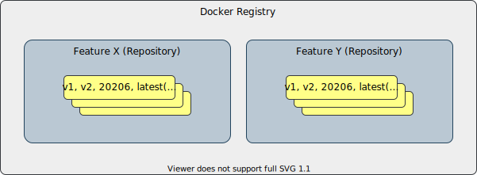

# High Level Design Document
#### Rev 0.2

# Table of Contents
- [High Level Design Document](#high-level-design-document)
- [Table of Contents](#table-of-contents)
- [List of Figures](#list-of-figures)
- [Revision](#revision)
- [About this Manual](#about-this-manual)
- [Scope](#scope)
- [Definitions/Abbreviation](#definitionsabbreviation)
- [Introduction](#introduction)
- [1.1 Feature Overview](#11-feature-overview)
- [1.2 Motivation](#12-motivation)
- [1.3 Requirements](#13-requirements)
- [2. Design](#2-design)
- [2.1 Basic concepts](#21-basic-concepts)
- [2.2 SONiC Package Manager](#22-sonic-package-manager)
- [2.3 SONiC Package Versioning](#23-sonic-package-versioning)
- [2.4 SONiC Package Manager Command Line Interface](#24-sonic-package-manager-command-line-interface)
- [2.5 Manifest File](#25-manifest-file)
- [2.6 Redis Database](#26-redis-database)
- [2.7 Logging](#27-logging)
- [2.8 YANG model](#28-yang-model)
- [2.9 Initial Extension Configuration](#29-initial-extension-configuration)
- [2.10 User Interface](#210-user-interface)
  - [2.10.1 SONiC Command Line Utilities](#2101-sonic-command-line-utilities)
  - [2.10.2 SONiC Management Framework Integration](#2102-sonic-management-framework-integration)
  - [2.10.3 SONiC Klish Command Line Interface](#2103-sonic-klish-command-line-interface)
  - [2.10.4 SONiC Telemetry Integration](#2104-sonic-telemetry-integration)
- [2.11 Processes and entry point](#211-processes-and-entry-point)
- [2.12 Feature Concept Integration](#212-feature-concept-integration)
- [2.13 Multi-ASIC support](#213-multi-asic-support)
- [2.14 Multi-DB support](#214-multi-db-support)
- [2.15 Orchagent](#215-orchagent)
- [2.16 Configuration Reload](#216-configuration-reload)
- [2.17 Warm restart](#217-warm-restart)
- [2.18 Debuggability](#218-debuggability)
- [2.19 SONiC-2-SONiC upgrade](#219-sonic-2-sonic-upgrade)
- [2.20 SONiC Processes and Docker Statistics Telemetry Support](#220-sonic-processes-and-docker-statistics-telemetry-support)
- [2.21 SONiC Application Extension Constrains](#221-sonic-application-extension-constrains)
- [2.22 SONiC Application Extension versioning](#222-sonic-application-extension-versioning)
- [2.23 SONiC Build System](#223-sonic-build-system)
- [3. SONiC Application Extension Example](#3-sonic-application-extension-example)
- [Open issues](#open-issues)

# List of Figures
- [Figure 2.1: Basic Concepts](#figure-21-basic-concepts)
- [Figure 2.2: SONiC REST API Extension. Basic approach](#figure-22-sonic-rest-api-extension-basic-approach)

# Revision

| Rev |     Date    |       Author            | Change Description                   |
|:---:|:-----------:|:-----------------------:|--------------------------------------|
| 0.1 | 05/2020     | Stepan Blyshchak        | Initial version                      |
| 0.2 | 06/2020     | Stepan Blyshchak        | Handle comments after initial review |

# About this Manual

This document provides an overview of the design of implementation of SONiC application extensions.

# Scope

This document describes the high level design of SONiC application extensions infrastructure.

# Definitions/Abbreviation

| **Abbreviation**         | **Definition**                         |
|--------------------------|----------------------------------------|
| SONiC                    | Software for Open Networking in Cloud  |
| SAE                      | SONiC Application Extension            |
| DB                       | Database                               |
| API                      | Application Programming Interface      |
| SAI                      | Switch Abstraction Interface           |
| YANG                     | Yet Another Next Generation            |
| JSON                     | Java Script Object Notation            |
| XML                      | eXtensible Markup Language             |
| gNMI                     | gRPC Network Management Interface      |

# Introduction

# 1.1 Feature Overview

SONiC Application Extension infrastructure - a SONiC infrastructure for building and integrating third-party out-of-tree services, features that provide their functionality as a docker container.

# 1.2 Motivation

The SONiC NOS was built with extendability in mind. This document focuses on making the process of extending SONiC as easy as possible.

The main building block of SONiC is Docker. We are going to leverage the existing Docker and Docker registry infrastructure and build SONiC application extension framework on top of it.

While Docker provides a tool for packaging an application and Docker Hub or registry for hosting it, it is not enough to just execute "docker pull" to make an application "look and feel" like a native SONiC application. SONiC application extension framework aims at making the process of development and integration of 3-rd party applications with a native integration into SONiC. For that we need to provide SONiC application extension framework with the API to connect every 3rd party application with the SONiC native infrastructure, like access to the database, SAI ASIC programming interface, sonic utility CLI, Klish based CLI, REST API, gNMI API, logging infrastructure, warm and fast restarts, etc.

When the SONiC application extension infrastructure will become a part of SONiC, application developer will not have to integrate every application into the SONiC codebase but maintain them separately. This follows all the popular Linux distributions that allow for installation of external applications.

This document while describing how SONiC application extension will be implemented also provides requirements and guidelines for SONiC extension application to follow, marked as *must*, *should* and *can* respectively.

# 1.3 Requirements

## Functional requirements

#### SONiC Application Extension
- Provides its functionality as another Docker container running alongside with other SONiC services
- Distributed as a Docker image available though Docker Hub or private registry
- Docker image contains metadata required for SONiC Application Extension infrastructure to integrate the feature properly with other SONiC components
- Can support warm-, fast-restart and must not break existing warm-, fast-restart functionality

#### SONiC Application Extension Infrastructure
- Every other core SONiC docker image is also a subject to the infrastructure
- Provides an interface to manage application extensions
- Performs validation of SONiC Application Extension Docker image
- Provides SONiC Application Extension versioning mechanism
- Compatibility constrains
  - Compatibility with other Applications
  - Compatibility with built-in features of SONiC
- Application upgrades
  - Manual upgrade
  - SONiC-2-SONiC upgrade
- Integration with *feature* concept, that means, an application is a subject to the same handlers as for other optional features
- Auto-generation of SONiC command line tools
- Integrates with Klish CLI, REST server, telemetry, etc.
- Access to Redis Database, syslog, Linux resources etc.
- Ability to do ASIC programming via SAI Redis
- Access to SAI objects created by orchagent
- Build infrastructure and tools for easier SAE development

# 2. Design

#### Assumptions

For simplicity, it is assumed that a SONiC application package name is the same as the feature name, the same as service name and the same as docker container name.

# 2.1 Basic concepts

**SONiC Application Extension** - SONiC compatible Docker image providing its functionality as a service

**SONiC Application Extension Repository** - store of SONiC compatible Docker images that can be referenced by using tags

**Docker registry** - a storage and content delivery system, holding named Docker images, available in different tagged versions


###### Figure 2.1: Basic Concepts

There are three notions: **extension**, **repository** and **registry**. A repository is basically a Docker registry (private or open like Docker Hub) repository with images for specific SAE. Once a repository is added, extension installation process will pull docker image from repository. Once installed, a feature can be managed using the *feature* commands in SONiC.

User flow is defined to be the following:
1. add a new extension repository
2. install an extension from repository
3. configure and enable installed feature

User flow to uninstall, remove repository:
1. uninstall extension
2. remove the extension repository from database

User flow to upgrade SONiC extension:
1. upgrade a feature from upstream repository
2. perform service restart, or warm service restart


SONiC Application Extension ***must*** provide a ***manifest*** file used to tell SONiC Application Extension Infrastructure how to integrate the extension with the rest of SONiC core services.
A manifest must exist inside an image under */var/lib/sonic-packages/\<extension-name\>/manifest.json*.

# 2.2 SONiC Package Manager

As any mature operating system distribution SONiC will use its own package management solution and provide a utility to manage packages. SONiC Package Manager will use a persistent storage for its purposes at */var/lib/sonic-packages/* on the host OS. There are going to be a *repositories.json* file as well as a directory per each SONiC package with a package metadata. A database will have the following structure:

```
/
  var/
    lib/
      sonic-packages/
        repositories.json
        database/
        swss/
        snmp/
        featureX/
        featureY/
        featureZ/
```

A locking mechanism will be used in order to make a package operation (installation, de-installation, upgrades) in atomic manner. For this a lock file */var/lib/sonic-packages/lock* will be created on every operation and released once operation is completed to guaranty that the database will be consistent if two or more operations are done at the same time.

Schema definition for *repositories.json* file is following:

Path                | Type               | Description
------------------- | ------------------ | -------------------------------------------
/name               | string             | Name of the package.
/name/repository    | string             | Repository in Docker registry or just an image name if a package was installed manually from local image.
/name/description   | string             | Application description field.
/name/tags          | list of strings    | A vector of versions tested to be compatible with the running SONiC base image release.
/name/default-tag   | string             | A tag which points to a package that will be a default installation candidate if not specified other.
/name/essential     | boolean            | A flag if a SONiC package is an essential package


An example of a content in JSON format:

```json
{
  "database": {
    "repository": "docker-database",
    "description": "SONiC database service",
    "essential": true
  },
  "swss": {
    "image": "docker-orchagent",
    "description": "SONiC switch state service",
    "essential": true
  },
  "cpu-report": {
    "repository": "Azure/cpu-report",
    "description": "CPU time report feature",
    "tags": ["1.0", "1.1"],
    "default-tag": "1.1"
  },
  "featureXXX": {
    "repository": "user/featureXXX",
    "description": "feature XXX description",
    "tags": ["v1-202006"],
    "default_tag": "v1-202006"
  }
}
```

SONiC image will come with default *repositories.json* with SONiC core services listed as well as optional applications extensions. Note, that a core SONiC service might not have a "tag" as well as "default-tag" information listed for the package. This is allowed to simplify transition to use the same packaging infrastructure for all docker containers. In the future, once a core service becomes a SONiC compatible docker image package and uploaded to Docker Hub that information will be listed for core SONiC packages as well.

# 2.3 SONiC Package Versioning

To decouple SONiC containers from SONiC base OS image they need to have a separate versioning, because now a SONiC OS  The format of SONiC base OS image version is the following: *${RELEASE_NUMBER}.${BUILD_NUMBER}-${BUILD_HASH}*. The build number is not reliable and does not tell if a package has been changed and the build hash cannot be used in version comparison. A different versioning method has to be suggested for SONiC packages.

A version of a SONiC core packages is defined by a Dockerfile version, a makefile and a set of files included into the Docker image, a set of upstream packages and a set of SONiC packages. The proposed automatic versioning of docker images for core SONiC containers is the following:

```
${RELEASE_NUMBER}.${COMMIT_NUMBER}
```

Where, RELEASE_NUMBER is a sonic-buildimage branch and COMMIT_NUMBER is a number of commits in Docker image related rules, files, packages, sub-modules.

The above proposed schema has the advantage of being easily automated by the build system and CI, the version is always unique and the version can be easily compared because it is always incrementing, e.g: 202006.156 < 202011.101, 202011.101 < 202011.105.

The package can declare a dependency on a particular package:

1. The dependent functionality in the dependent package in version 202006.156, any greater has this functionality and is compatible.
2. The dependent functionality was added to 202006.156 but hasn't been added to 202011, the package has to declare that dependency in the following way: >= 202006.156 && < 202011.
3. The dependent functionality has been reverted in 202006.158, the dependent package has to declare that it breaks the package. 

For easier correlation with exact source version of sonic-buildimage used to build a core package a usual tag in the old format pointing to the same image will still be present in the system:

```
admin@sonic:~$ docker images | grep database
docker-database   master.355-ee4197e9   63b010460d83        4 days ago          410MB
docker-database   202006.156            63b010460d83        4 days ago          410MB
```

# 2.4 SONiC Package Manager Command Line Interface

The SONiC Package Manager will be another executable utility available in base SONiC OS and called *sonic-package-manager-manager* or abbreviated to *spm*. The command line interfaces is given bellow:

#### CLI

```
admin@sonic:~$ sonic-package-manager-manager
Usage: sonic-package-manager [OPTIONS] COMMAND [ARGS]...

  CLI to manage SONiC application packages

Options:
  --help  Show this message and exit

Commands:
  repository  List, add or remove SONiC application extensions repository list
  list        List installed and built-in SONiC packages
  install     Install SONiC package from repository
  upgrade     Upgrade SONiC package
  uninstall   Uninstall SONiC package
```

#### List of packages available
```
admin@sonic:~$ sonic-package-manager list
Name         Repository             Description              Tag            Status
-----------  ---------------------  ------------------------ ------------   --------------
database     Azure/sonic-database   SONiC database           202011.156     Built-In
swss         docker-orchagent       Switch state service     202011.156     Built-In
syncd        docker-syncd-vs        SONiC ASIC sync service  202011.156     Built-In
teamd        docker-teamd           SONiC teaming service    202011.156     Built-In
cpu-report   Azure/cpu-report       CPU time report feature  1.0, 1.1       Installed (1.1)
featureXXX   user/featureXXX        feature XXX description  v1-202006      Not installed
```

#### Repository management

```
admin@sonic:~$ sudo sonic-package-manager repository add [NAME] [REPOSITORY] --description=[STRING] --tag=[STRING]
admin@sonic:~$ sudo sonic-package-manager repository remove [NAME]
```

#### Package Installation

```
admin@sonic:~$ sudo sonic-package-manager install cpu-report
```

Install a specific tag:
```
admin@sonic:~$ sudo sonic-package-manager install cpu-report --tag=1.1
```

An option "--tag" in CLI will allow user to install any version of extension. If tag is not listed in *repositories.json* for an extension the installation will warn the user:

```
admin@sonic:~$ sudo sonic-package-manager install cpu-report --tag=latest
Tag "latest" is not in repositories.json. Proceed with installation [y/N]?:
```

It will be possible to install the extension from a Docker image file; convenient for unpublished images.

```
admin@sonic:~$ ls featureA.gz
featureA.gz
admin@sonic:~$ sudo sonic-package-manager install featureA.gz
```

This option should mainly be used for debugging, developing purpose, while the preferred way will be to pull the image from repository.
Repository list is not updated in this case, because it was a local installation.

```show version``` command can be used to display feature docker image version.

#### Package Upgrade

```
admin@sonic:~$ sudo sonic-package-manager upgrade featureA --tag=202011.353
```

Enable warm restart if feature supports and restart the service:
```
admin@sonic:~$ sudo config warm-restart enable featureA
admin@sonic:~$ sudo systemctl restart featureA
```

# 2.5 Manifest File

Every SONiC application extension **must** provide a *manifest.json* file in image fs under */var/lib/sonic-packages/\<package-name\>/manifest.json*.
The following table describes schema for version 1.0:

Path                        | Type                  | Description
--------------------------- | --------------------- | ----------------------------------------------------------------------------------------
/version                    | string                | Version of manifest file definition
/depends                    | list of strings       | The list of core services the service depends on in the format "[>|>=|==|<|<=]<package>:<tag>".
/breaks                     | list of strings       | The list of core services the service depends on in the format "[>|>=|==|<|<=]<package>:<tag>".
/service/                   | object                | Service related properties
/service/requires           | list of strings       | List of SONiC services the application requires on cold start, restart, boot.
/service/after              | list of strings       | List of SONiC core services the application is set to start after
/service/before             | list of strings       | List of SONiC core services the application is set to start before
/container/                 | object                | Container related properties
/container/privileged       | boolean               | Run container in privileged mode
/container/mounts           | list of strings       | List of mounts for container

A required "version" field can be used in case the format of manifest.json is changed in the future. In this case a migration script can be applied to convert format to the recent version. This is similar to approach SONiC uses for CONFIG DB version.

Service properties "requires" and "after", "before" are related to service management, it maps to systemd unit attributes and can be extended in the future on demand if needed.

Service file will be auto-generated from generic */usr/share/sonic/templates/service.j2* file; "swss" service in "requires" is a special case. Instead of putting swss.service into ```Requires=``` fields in feature systemd service file, the dependency has to be handled inside */usr/local/bin/swss.sh* script in order to not break swss warm restart. The list of dependent services is now dynamic so should be updated by SONiC Application Extension Infrastructure. The list of dependent services will be stored at */etc/swss-dependent-services.json*.

Container options are mapped to ```docker create``` options. This dictionary is used to auto-generate service start/stop script from *docker_image_ctl.j2* file. It is required to have this file as part of SONiC image and put it in */usr/share/sonic/templates/docker_image_ctl.j2*.

Next sections extend the above manifest format with new data nodes.

# 2.6 Redis Database

By default */var/run/redis/* is mapped to every SONiC Application Extension container at runtime to allow container to have DB access.

An application must be using *swsscommon* or *swsssdk* instead of direct access to DB to be able to handle Multi-DB scenario.

# 2.7 Logging

By default */dev/log* and *rsyslogd* will be available for every SONiC Application Extension container allowing containerized applications to write to logs. *rsyslogd* process will be started in container by default.

# 2.8 YANG model

Installed application should have a way to advertise its methods, capabilities, configuration schema to the rest of the system and the user. For this purpose YANG model is chosen as it is already in use in SONiC.

SONiC Application Extension *can* provide a list of YANG modules. These YANG modules should describe CONFIG DB schema as well as methods provided by the application.

YANG modules *must* be written according to [SONiC Yang Model Guidelines](https://github.com/Azure/SONiC/blob/master/doc/mgmt/SONiC_YANG_Model_Guidelines.md).

Based on SONiC YANG model, sonic-utilities extensions for *show*, *config*, *sonic-clear* utilities can be automatically generated. Taking the advantage of the YANG model and existing infrastructure provided by management framework to automatically generate code for REST API and gNMI interfaces.

For some scenarios, a YANG model does not provide enough information for auto-generation tools. Custom SONiC extensions to YANG will provide hints for code generators.

###### Manifest file path 

Path                        | Type                  | Description
--------------------------- | --------------------- | --------------------------------------------------------------------------------------------------------
/yang-path                  | string                | Path to directory where SONiC YANG modules are located inside docker image relatively to manifest file

###### Example

```json
{
  "yang-path": "models/"
}
```

# 2.9 Initial Extension Configuration

SAE *can* provide an initial configuration it would like to start with after installation. The JSON file will be loaded into running CONFIG DB and boot CONFIG DB file during installation.


###### Manifest file path 

Path                        | Type                  | Description
--------------------------- | --------------------- | ----------------------------------------------------------------------------------------
/init-cfg                   | string                | Path to SONiC Extension Initial Configuration JSON file relatively to manifest file

# 2.10 User Interface

This section describes how SONiC Application Extensions integrates with SONiC user interfaces.

## 2.10.1 SONiC Command Line Utilities

### SONiC Utilities plugin support

SONiC utilities support *show*, *config*, *sonic-clear* operations. A plugin approach is taken when extending those utilities. A common way to introduce a plugin support for a python application is to structure a plugin as a python module that can be discovered by the application in a well known location in the system.

The proposed location is a package directory named *plugins* under each *show*, *config*, *sonic-clear* python package, so that by iterating modules inside those packages utilities can load them. This is implemented in a way defined in [Python Packaging Guide. Creating and discovering plugins](https://packaging.python.org/guides/creating-and-discovering-plugins/#using-namespace-packages).

A code snipped describing the approach is given:

```python
import show.plugins

def iter_plugins_namespace(ns_pkg):
    return pkgutil.iter_modules(ns_pkg.__path__, ns_pkg.__name__ + ".")

discovered_plugins = {
    name: importlib.import_module(name)
    for finder, name, ispkg
    in iter_namespace(show.plugins)
}

for plugin in discovered_plugins.values():
    plugin.register_cli(cli)
```

An auto-generated plugin will have a module level function *register_cli(cli)* that accepts the Click CLI object. SONiC utility application will call that method right after plugins discovery. A plugin will register it's sub-commands so that any utility will have a new sub-command group.

### SONiC Utilities Plugin Auto-Generation

Based on the YANG model the following rules will be used to generate a command tree:

1. A new top level sub-command named after top level container in YANG module is added for "show" and "config" command groups.

###### Example

For a feature *featureX*
```
admin@sonic:~$ show featureX
admin@sonic:~$ config featureX
```

2. Each container in YANG is a sub-command in *show*, *config* utilities

###### Example

```yang
container global {
  description "Global feature configuration";
  // ...
}
```

```
admin@sonic:~$ show featureX global
admin@sonic:~$ config featureX global
```

3. In case when container contains leaf nodes, sub-commands for *config* are auto-generated for each leaf. The *show* command to display all leafs in a table view will be auto-generated

###### Example

```yang
container global {
  description "Global feature configuration";

  // DB schema
  sonic-ext:table-name “FEATURE_X”;
  sonic-ext:key-name “global”;

  // ...
  leaf polling-interval {
    // DB schema
    sonic-ext:field-name “polling_interval”;
    // ...
  }
  leaf threshold {
    // DB schema
    sonic-ext:field-name “threshold”;
    // ...
  }
}
```

```
admin@sonic:~$ show featureX global
Field              Value
-----------------  ---------------
polling-interval   5
threshold          80
admin@sonic:~$ config featureX global polling-interval 5
```


4. In case when container has a list node, sub-commands for *config* are auto-generated to *add*, *delete*, *update* sub-commands. Mandatory leafs are positional arguments in *config* while not mandatory or leafs with default values are optional. In case of *show* command a sub-command to display configuration is auto-generated and the data is represented as a table.

```yang
container objects {
  // ...
  list object-list {
    key name;
    leaf attribute-one {
      // ...
      mandatory true;
      type uint16 {
        range "1..4095" {
          error-message "Out of range";
        }
      }
    }
    leaf attribute-two {
      // ...
      default 5;
    }
  }
  // ...
}
```

```
admin@sonic:~$ show featureX objects
Name     attribute-one   attribute-two
-------  --------------  --------------
object1  10              5
object2  1000            10
admin@sonic:~$ sudo config featureX objects add <name> <attribute-one> [--attribute-two=INT]
```

5. For RPC methods defined in YANG module a sub-commands in either *sonic-clear* or *show* groups are generated, but not in *config* group. The RPC method *should* contain a metadata information to define in which command group it should exist. The RPC method also *should* contain an executable path which will be invoked with arguments defined in *input* statement.


Two new SONiC YANG extensions will be added:

Extension                  | Value                      | Description
---------------------------|----------------------------|-------------------------------------------------------------------------------
sonic-ext:op               | enum (show/clear)          | An extension for RPC method to define in which command group it should exist
sonic-ext:exec             | string                     | A path of an executable inside application container to invoke for this RPC

###### Example

```yang
rpc stats {
    description "Show statistics";

    sonic-ext:group show;
    sonic-ext:exec "/usr/bin/stats";

    input {
        leaf counter {
            type leafref {
                path "../../counter/counter-list/name";
            }
        }
    }
}
```

```
admin@sonic:~$ show featureXXX stats
```

6. Extending external commands using ```augment``` statement.

###### Example

```yang
container dhcp-relay {
  augment /sonic:sonic-vlan/VLAN/VLAN_LIST;
  leaf-list dhcp-servers {
    type inet:ip-address;
  }
}
```

***NOTE***: VLAN feature in this case is provided by swss container, swss container has to provide sonic-vlan.yang and VLAN CLI has to be auto-generated from that YANG module.

```
admin@sonic:~$ sudo config vlan update Vlan1000 dhcp-servers add 192.168.100.100
```

## 2.10.2 SONiC Management Framework Integration

SONiC Management Framework provides a northbound API like REST API and also a CISCO-like CLI based on open-source project Klish.

[SONiC Management Framework HLD](https://github.com/Azure/SONiC/blob/master/doc/mgmt/Management%20Framework.md)

### SONiC Application Extension REST API

SAE *can* provide a REST API for a feature. The REST API is mainly defined by the SONiC YANG module, however if feature wants to expose REST API according to openconfig spec a special translation logic will be needed.

The REST API implementation could be autogenerated but in that case we'll loose the flexibility of defining a custom REST which is not based on SONiC YANG model. SONiC REST server is written in golang and sonic management framework provides a set of tools to auto-generate go code for REST server. SAE infrastructure could do this in runtime and then compile the go code into a plugin for REST server like it is done in case of SONiC utilities, but in this case we would need the whole go tool chain installed on SONiC, besides, it is not flexible enough to implement custom REST API.

REST server in SONiC is running inside *mgmt-framework* container. SAE has to be able to extend current set of REST API with new routes provided by application and defined in YANG model. SAE will use a standard way of extending REST in micro services based pattern.

When making a request to a REST server, the client makes a request via a server running in *mgmt-framework* container which will act as a router that runs at a well known location. The router queries a service registry, and forwards the request to an available service instance. The role of a service registry will take Redis DB, once service is started it will register itself in STATE DB in Redis DB, so that a REST server will be able to discover it.

SAE infrastructure should take care of generating a code that will auto register a service in STATE DB. This code will be a part of a container start and executed inside container.

SAE REST server extension process *must* listen on Unix socket for request. Since, it is not guarantied that SAE will run in the same network namespace as *mgmt-framework*, binding to localhost is not an option.

SAE infrastructure will map the base path of the socket path specified in the manifest to host path */var/run/sonic-packages/\<extension-name\>/\<socket-file\>.sock*. The base folder of */var/run/sonic-packages/* is mapped to *mgmt-framework* container by default, so that *mgmt-framework* is able to perform requests to the rest extension process running inside SAE container.


***Open Question***: Should we put a Registry table into STATE DB or separate it into another DB?

###### Figure 2.2: SONiC REST API Extension. Basic approach

1. Feature REST server registers itself in STATE DB in *REST_SERVICE REGISTRY* table
2. REST client performs a request
3. REST server fetches the registered application extensions from STATE DB from *REST_SERVICE REGISTRY*
4. REST server routes the request to the feature REST server

#### STATE DB

STATE DB ABNF schema for REST_SERVICE_REGISTRY table.

```
;Defines REST_SERVICE_REGISTRY table in STATE DB
key                 = REST_SERVICE_REGISTRY|1*ALPHA    ; Feature name
route               = [1*ALPHA]+                       ; Comma separated route prefixes list
path                = 1*ALPHA                          ; path relative to base path "/var/run/sonic-packages/"
```

###### Manifest file path 

Path                        | Type                  | Description
--------------------------- | --------------------- | ----------------------------------------------------------------------------------------
/rest/                      | object                | REST API extension node
/rest/unix-socket-path      | string                | A unix socket path the rest extension process is listening to. SAE Infrastructure will share this socket file with *mgmt-framework* container.
/rest/routes                | list of strings       | A list of routes the extension provides. SAE Infrastructure will generate start script code to automatically register the extension in *REST_SERVICE_REGISTRY* table

## 2.10.3 SONiC Klish Command Line Interface

Klish is a modular framework for implementing a CISCO-like CLI on a *NIX system. Arbitrary command menus and actions can be defined using XML files. This software handles the user interaction, and forks the appropriate system commands to perform any actions.

Klish CLI is implemented as part of *mgmt-framework* container. In most cases it uses REST API to execute commands and Jinja2 templates to render the REST API response to the output.

Klish CLI is using XML formatted configuration files to define a CLI tree and actions for those commands. Example is given for action-ers:

```xml
<COMMAND name="show cpu-report statistics" help="Show CPU report statistics">
  <ACTION builtin="clish_restcl">oper=GET url=/restconf/data/sonic-cpu-report:cpu-report/stats/ renderer=show_stats.j2</ACTION>
</COMMAND>
```

The above example on *show cpu-report statistics* command will execute a REST API and pass the response to *show_stats.j2* which will render the output to the user in human readable format.

There is no point for auto-generation of XML as custom generation tools will only limit the flexibility of Klish configuration abilities. The SAE could provide the XML to *mgmt-framework* as is. This approach however introduces a vulnerability since ```<ACTION></ACTION>``` tag can contain any shell script to be executed in the context of *mgmt-framework* container. In order to avoid such vulnerability a SAE should use only builtin actions like "clish_restctl" and SAE infrastructure should take care of validating actions provided by the extension. This is a limitation for SAE since Klish CLI won't be able to execute any script inside a SAE container, however, calling REST API should be sufficient in all cases - configuration, show commands, invoking custom RPCs, etc.

SAE infrastructure database will be mapped to *mgmt-framework*, so that a directory containing XML files and Jinja2 templates become available for Klish. *CLISH_PATH* environment variable should be extended with those directories.

SAE image must place Klish resources in the following structure:
- XML Klish configuration files: */var/lib/sonic-packages/\<feature\>/klish/\*.xml*.
- Jinja2 templates for renderer: */var/lib/sonic-packages/\<feature\>/klish/templates/\*.j2*.

###### Manifest file path 

Path                        | Type                  | Description
--------------------------- | --------------------- | ----------------------------------------------------------------------------------------
/klish/                     | object                | Klish CLI extension node
/klish/resources            | string                | A path inside container that SAE Infrastructure will share with *mgmt-framework* container to load XML Klish configuration files and Jinja2 templates

## 2.10.4 SONiC Telemetry Integration


***Open Question***: Should we put a Registry table into STATE DB or separate it into another DB?

###### Figure 2.2: SONiC Telemetry Extension. Basic approach

#### STATE DB

STATE DB ABNF schema for TELEMETRY_SERVICE_REGISTRY table.

```
;Defines TELEMETRY_SERVICE_REGISTRY table in STATE DB
key                 = TELEMETRY_SERVICE_REGISTRY|1*ALPHA ; Feature name
TARGET              = [1*ALPHA]+                       ; Comma separated prefixes list of xpath for gNMI for xpath_target TARGET
path                = 1*ALPHA                          ; path relative to base path "/var/run/sonic-packages/"
```

###### Manifest file path 

Path                        | Type                  | Description
--------------------------- | --------------------- | ----------------------------------------------------------------------------------------
/telemetry/                      | object                | Telemetry extension node
/telemetry/unix-socket-path      | string                | A unix socket path the rest extension process is listening to. SAE Infrastructure will share this socket file with *mgmt-framework* container.
/telemetry/xpath                | list of objects       | A list that defines xpath and targets the extension provides.
/telemetry/xpath/name                | string       | Name of the xpath target
/telemetry/xpath/path_list      | list of strings | A list of prefixes the extension provides. SAE Infrastructure will generate start script code to automatically register the extension in *TELEMETRY_SERVICE_REGISTRY* table

# 2.11 Processes and entry point

SAE *must* be built from base SONiC docker image provided by SAE Infrastructure. This docker image should include necessary processes that should be running inside the container by default - *supervisord*, *rsyslogd*, etc. SAE's extension entrypoint must be *supervisord* process and all the processes provided by the extension must be managed by *supervisord*.

Some of SONiC general features, like container auto-restart feature, critical processes death detection, processes and docker telemetry are implemented as part of the container itself and are relying on the fact that the container uses *supervisord* and runs *supervisor-proc-exit-listener* script inside the container. This is the reason why processes are defined in the manifest file as we want to provide an abstraction to hide the requirement and implementation of those features.

Processes information is used to autogenerate supervisord configuration file from */usr/share/sonic/templates/supervisord.conf.j2*. This template will include by default such processes like *rsyslogd*, *supervisor-proc-exit-listener* and *supervisor-dependent-startup* processes. Once the template is rendered it will be put into container filesystem under */etc/supervisor/* and container content will be committed to save this change into image.

###### Manifest file path

Path                             | Value                 | Description
---------------------------------|-----------------------|-------------------------------------------------------------
/processes/                      | list                  | Processes running in container
/processes/name                  | string                | Process name
/processes/name/critical         | boolean               | Wether the process is a critical process
/processes/name/command          | string                | Command to run the process
/processes/name/start-depends    | string                | Format of "<process-name>:<state>"        
/processes/name/reconciles       | boolean               | Wether process performs warm-boot reconciliation

A *supervisord.conf* file is auto-generated based on above data. *rsyslogd*, *supervisord-dependent-startup* and *supervisord-proc-exit-listener* processes are configured by default. SAE should not list the in the processes list.

The *reconciles* flag indicates wether a process performs warm boot reconciliation. In case it is a list of processes to wait for should be extended in *finalize-warmboot.sh*. The list of processes should not be hardcoded in the script but extended dynamically. A list of processes will be saved in */etc/warm-boot-reconcile-processes.json*.

# 2.12 Feature Concept Integration

SONiC controls optional feature (aka services) via FEATURE table in CONFIG DB.
Once SONiC Application Extension is installed in the system it must be treated in the same way as any optional SONiC feature.

SAE Infrastructure *must* register new feature in CONFIG DB.

[Optional Feature HLD Reference](https://github.com/Azure/SONiC/blob/master/doc/Optional-Feature-Control.md)

Features are configured in *FEATURE* table in *CONFIG DB* and backend - *hostcfgd* daemon - enables, disables features according to the configuration.

Default desired state for a SONiC Application Extension is "disabled". After installation, user can enable the feature:

```
admin@sonic:~$ sudo config feature featureA enabled
```

SONiC Application Extension will automatically support *CONTAINER_FEATURE* configuration, like auto-restart on failure or high memory usage.

# 2.13 Multi-ASIC support

TBD.

# 2.14 Multi-DB support

Application should be using swss-common library or swsssdk which take care of discovering database instances.

# 2.15 Orchagent

TBD.

# 2.16 Configuration Reload

SAE service should restart on initiated *config reload* commands.

Service management and services dependencies management in SONiC is complex. *config reload* command has a list of services it needs to restart on reload. This list becomes dynamic with introduction of extension.

A service is restarted in this case if its dependency is restarted (like swss) or it should be restarted explicitly. *config reload* will use SONiC Application Extension API to get the list of extension needed to be restarted. If an extension's core SONiC service dependency is already in a list of restarting services it will skip explicit restart.

# 2.17 Warm restart

SONiC Application Extension *can* specify a stage at which the extension needs to be shutdown at warm reboot in manifest file.
Some extensions might require to be stopped at the last moment before CPU port becomes unavailable (e.g. teamd).
Two possible shutdown stages are defined by Application Extension Infrastructure - *swss* and *syncd*.
If SAE specifies *swss* the extension will shutdown before swss service goes down, if it specifies *syncd* the extension will be shut down before *syncd* service goes down.
If neither is specified the extension will be shutdown right before *kexec*.

###### Manifest file path

Path                   | Value             | Description
-----------------------|-------------------|---------------------------------------------------------------------------------
/warm-shutdown-stage   | string            | A service the extension is bound in warm shutdown; either *swss* or *syncd*

# 2.18 Debuggability

SONiC Application Extension *can* specify a command to execute inside container to get the debug dump that should be included in system dump file. This command should be specified in manifest file. A command should write its debug dump to stdout which will be gzip-ed into a file during *show techsupport* execution. This file will be included in techsupport under *dump/\<extension-name\>/dump.gz*.

###### Manifest file path

Path                   | Value             | Description
-----------------------|-------------------|---------------------------------------------------------------------------------
/debug-dump            | string            | A command to be executed during system dump

# 2.19 SONiC-2-SONiC upgrade

During SONiC-2-SONiC upgrades an extension should be installed in the new image filesystem. CONFIG DB file with feature configuration is migrated to the new image. An extension should keep it's configuration backward compatible with old version. While executing *sonic-installer install* command the installation script will chroot into new SONiC image filesystem, start a docker daemon and perform installation steps, except of installing a default extension's configuration into CONFIG DB. After installation succeeded and reboot into new image is performed all previously installed extensions should be available.

An option to skip migrating extensions will be added for users that want to have a clean SONiC installation:


```
admin@sonic:~$ sudo sonic-installer install -y sonic-$Platform.bin --migrate-extensions false
```

# 2.20 SONiC Processes and Docker Statistics Telemetry Support

[Processes And Docker Stats Telemetry HLD](https://github.com/Azure/SONiC/blob/master/doc/system-telemetry/process-docker-stats.md)

This feature should be supported by SONiC Application Extension without any changes to existing feature implementation.

# 2.21 SONiC Application Extension Constrains

## Conflicting Functionality

Some SAEs might conflict with another SAEs or existing optional feature or built-in SONiC functionality. SONiC application extension **should** provide such information and the infrastructure will take care of not allowing conflicting functionality to coexist at the same time.

##### Case 1. SONiC Application Extension Conflicts with Another Optional Feature

SONiC application may define a conflicts with another optional feature. In this case, if the feature is in "enabled" state, SAE should not be started. This is implemented by setting a *Confict* setting in systemd service file. A message will be shown to the user in the output of *systemctl status featureA* command.

##### Case 2. SONiC Application Extension Conflicts with Built-In SONiC SWSS functionality

***NOTE***: This section is meant for only those modules or orchagent which are optional or conflicting with some SAEs but are not planned to be converted to a separate SONiC Application Extension.

It is possible that one SONiC extension conflicts with part of SWSS functionality. This conflict cannot be solved on a *FEATURE* table level or service level. To solve this conflict we introduce a *SWSS_FEATURE* CONFIG DB table and corresponding *featureorch* to handle configuration from that table.

Upon start, SAE Infrastructure will auto-generate code in the service start script to verify that the conflicting SWSS feature is in disabled state.

Orchagent will consume SWSS_FEATURE table entries and enable or disable an Orch module. This configuration will be read once upon orchagent start.

###### Manifest file path

Path                        | Type                  | Description
--------------------------- | --------------------- | ----------------------------------------------------------------------------------------
/constrains/                | object                | Application Constrains definitions
/constrains/conflicts       | list of strings       | List of features this feature conflicts with and cannot run at the same time
/constrains/conflicts-swss  | list of strings       | List of SWSS built-in features this feature conflicts with

# 2.22 SONiC Application Extension versioning

Extension maintainers have to tag their extension images and update *repositories.json*.

# 2.23 SONiC Build System

SONiC build system will provide three docker images to be used as a base to build SONiC application extensions - *sonic-sdk-buildenv*, *sonic-sdk* and *sonic-sdk-dbg*.

*sonic-sdk-buildenv* will have common SONiC packages required to build SONiC application extension and will be a minimal version of sonic-slave container:

- build-essential
- libhiredis-dev
- libnl*-dev
- libswsscommon-dev
- libsairedis-dev
- libsaimeta-dev
- libsaimetadata-dev
- tools, etc.

*sonic-sdk* will be based on *docker-config-engine* with addition of packages needed at run time:

- libhiredis
- libnl*
- libswsscommon
- libsairedis
- libsairedis
- libsaimeta
- libsaimetadata

Corresponding *-dbg* packages will be added for *sonic-sdk-dbg* image.
A list of packages will be extended on demand when a common package is required by community.
If a package is required but is specific to the SONiC application extension it should not be added to this list.

Developer of SONiC application extension can use those docker images to build his extension.

```Dockerfile

FROM sonic-sdk-buildenv:202006.1-583bfde4 as build-env

# Building packages here, like feature_1.0.0_amd64.deb

FROM sonic-sdk:202006.1-583bfde4 as run-env

# Copy artifacts from build environment 
COPY --from=build-env ["feature_1.0.0_amd64.deb", "/"]

# Installing packages
```

# 3. SONiC Application Extension Example

The example is given for an application that monitors CPU time for select processes and reports the statistics to the remote collectors.

*/var/lib/sonic-packages/cpu-report/manifest.json*:
```json
{
  "version": "1.0",
  "name": "cpu-time-report",
  "constrains": {
  },
  "service": {
    "requires": [ "swss", "syncd", "database" ],
    "after": [ "swss", "syncd", "database" ],
    "before": [ "ntp-config" ],
  },
  "container": {
    "privileged": true,
  },
  "rest-server": {
    "path": "/var/run/cpu-report/cpu-report.sock",
    "routes": [
      "/sonic-cpu-report:cpu-report/"
    ]
  },
  "processes": [
    {
      "name": "cpu-report",
      "critical": true,
      "command": "/usr/bin/cpu-report"
    },
    {
      "name": "cpu-report-rest-server",
      "command": "/usr/bin/cpu-report-rest-server"
    }
  ],
  "yang-model": "sonic-cpu-report.yang",
  "init-cfg": "init-cfg.json"
}
```

*/var/lib/sonic-packages/cpu-report/sonic-cpu-report.yang*:
```yang
module sonic-cpu-report {
    yang-version 1.1;

    namespace "https://github.com/Azure/sonic-cpu-report";

    prefix "sonic-cpu-report";

    import sonic-extension {
        prefix sonic-ext;
        revision-date 2019-07-01;
    }

    import sonic-utilities {
        prefix sonic-utilities;
        revision-date 2020-06-01;
    }

    import ietf-inet-types {
        prefix inet;
        revision 2010-09-24;
    }

    import ietf-yang-types {
        prefix yang-types;
        revision 2010-09-24;
    }

    organization "Open Compute Project";
    contact "https://azure.github.io/SONiC/";

    description "This model contains a collection of YANG definitions
                 provided by SONiC CPU report extension";

    revision 2020-06-01 {
        description "First Revision";
    }

    container cpu-report {
        description "CPU report interfaces";

        container global {
            description "CPU report global configuration leafs";

            sonic-ext:table-name “CPU_REPORT”;
            sonic-ext:key-name “global”;

            leaf polling-interval {
                description "CPU report polling interval.
                             Defines the global frequence of polling
                             CPU stats in seconds.";

                sonic-ext:field-name "polling_interval";

                type uint32;
            }
        }
        container counter {
            description "CPU statistic counter objects configuration interface";

            sonic-ext:table-name “CPU_REPORT_COUNTER”;

            list counter-list {
                description "CPU statistics counter objects list";
                key name;

                leaf name {
                    description "Counter's user-defined name";
                    mandatory true;
                    type string;
                }

                leaf "pattern" {
                    description "Process pattern to match for CPU report";
                    mandatory true;
                    type string;
                }
            }
        }
        container collector {
            description "Collector objects configuration";

            sonic-ext:table-name “CPU_REPORT_COLLECTOR”;

            key name;

            list collector-list {
                description "Collector objects list";

                leaf name {
                    description "Collector's user-defined name";
                    mandatory true;
                    type string;
                }

                leaf address {
                    description "Collector's IP address";
                    mandatory true;
                    type inet:ip-address;
                }

                leaf port {
                    description "Collector's port";
                    mandatory true;
                    type inet:port-number;
                }
            }
        }

        rpc clear-stats {
            description "Clear counter statistics";

            sonic-ext:group clear;
            sonic-ext:command stats;
            sonic-ext:binary "cpu-report:/usr/bin/clear-stats";

            input {
                leaf counter {
                    type leafref {
                        path "../../counter/counter-list/name";
                    }
                }
            }
        }

        rpc stats {
            description "Retrieve counter statistics";

            sonic-ext:group show;
            sonic-ext:binary "cpu-report:/usr/bin/stats";

            input {
                leaf counter {
                    type leafref {
                        path "../../counter/counter-list/name";
                    }
                }
            }
            output {
                leaf stats {
                    type yang-types:counter64;
                }
            }
        }
      }
    }
}
```

*/var/lib/sonic-packages/cpu-report/init-cfg.json*:

```json
{
  "CPU_REPORT|global": {
    "polling_interval": "5"
  },
  "CPU_REPORT_COUNTER|orchagent": {
    "pattern": "^/usr/bin/orchagent .*$"
  }
}
```

###### Auto-generated SONiC Utilities CLI

According to the YANG model above SONiC Application Extension framework generates:

For cpu-time-report global configuration:
```
admin@sonic:~$ sudo config cpu-report global enable
admin@sonic:~$ sudo config cpu-report global poll-interval 5
```

For tables containing objects, e.g. CPU_REPORT_COUNTER table:
```
admin@sonic:~$ sudo config cpu-report counter create orchagent-counter '/usr/bin/orchagent*'
admin@sonic:~$ sudo config cpu-report counter create syncd-counter '/usr/bin/syncd*'
admin@sonic:~$ sudo config cpu-report counter remove orchagent-counter
```

For tables containing objects, e.g. CPU_REPORT_COLLECTOR table:
```
admin@sonic:~$ sudo config cpu-report collector create my_collector 10.0.0.1 8888
admin@sonic:~$ sudo config cpu-report collector remove my_collector
```

Show for predefined keys:
```
admin@sonic:~$ show cpu-report global
polling-interval
-----------------
5
```

Show for process and collectors:

```
admin@sonic:~$ show cpu-report counter
name                pattern   
------------------  ---------------
orchagent-counter   orchagent
syncd-counter       syncd
```

```
admin@sonic:~$ show cpu-report collector
name           address     port
-------------  ----------  ------
my_collector   10.0.0.1    8888
``` 

Auto-generated CLI for RPC defined in YANG module:

For stats RPC command:
```
admin@sonic:~$ show cpu-report syncd-counter
counter
----------
12341
```

For clear-stats RPC command:
```
admin@sonic:~$ sonic-clear cpu-report syncd-counter
```

# Open issues
