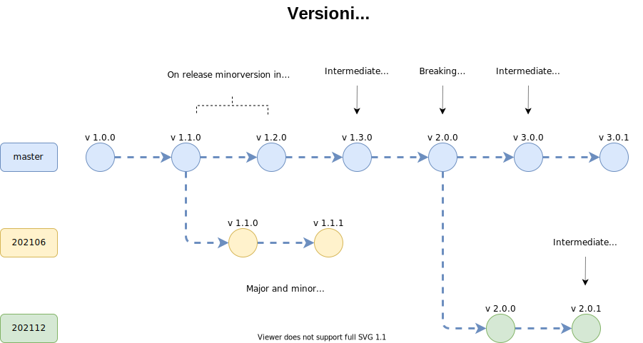

# SONiC Versioning

## Package API

A package API is a Redis DB interface including:
  - CONFIG DB, APPL DB, STATE DB tables schema provided by this package
  - Redis-based IPC Communication API: libswsscommon, libsairedis

## SONiC dockers versioning

- Manual version update ***happens on SONiC release/branch-out*** or on bug fixes which require a new package to be published to users via container registry.
- Within a release major and minor version ***must*** not change meaning API compatibility is promised
- On release/branch-out ***package maintainer must*** check package API compatibility with previous release
- In case API changed comparing to previous release ***package maintainer must*** must increment major version in master prior to branch-out
- In case API didn't change comparing to previous release ***package maintainer must*** must increment minor version in master prior branch-out
- *Patch* version is updated on bug fixes and minor enhancements. Since this is a tedious work to do mannually on every change
  this can be done only when the package is published to users via container registry.
  A package is published with a bug fix or enhancement whenever ***package maintainer decides*** to do so.



***package maintainer can*** update *default_reference* in package.json in SONiC buildimage to point to a default version which will be used when user installs a package.

## Base OS versioning

## Base OS API that a package uses

- SONiC utilities; Until CLI autogeneration, sonic utilities plugin system API incompatibility must be recorded by base OS major version increment
    - This is a ***sonic-utilities contributor responsibility***
- Dependence on a new kernel functionality must be recorded in minor version
    - This is a ***package maintainer responsibility***
    E.g.: a patch in kernel to support 3-tuple conntrack entries that NAT docker depends on. (e.g. sonic-linux-kernel update in sonic-buildimage should result in increment: 1.4.5(current) to 1.5.0)
    A dependency should be defined in manifest.json:
    ```json
    {
        "package": {
            "base-os-constraint": "^1.5.0"
        }
    }
    ```

