# Warm Reboot

## Overview

The goal of SONiC warm reboot is to be able to restart and upgrade SONiC software without impacting the data plane.
Warm restart of each individual *feature* is also part of the goal.

## Use cases

## In-Service restart

The mechanism of restarting a component without impact to the service. This assumes that the software version of the component has not changed after the restart.
There could be data changes during restart window:
- new/stale route
- port state change
- fdb change 

Component here could be the whole SONiC system or just one or multiple of the *feature*s running in SONiC.

## In-Service upgrade

The mechanism of upgrading to a newer version of a component without impacting the service.

Component here could be the whole SONiC system or just one or multiple of the dockers running in SONiC.

## Un-Planned restart

It is desired for all network applications and orchagent to be able to handle unplanned restart, and restore gracefully.
It is not a requirement on syncd and ASIC/LibSAI due to dependency on ASIC processing.

### Per-component examples

### BGP restart

After BGP restart, new routes may be learned from BGP peers and some routes which had been pushed down to APP DB and ASIC may be gone.
The system should be able to clear the stale route from APP DB down to ASIC and program the new route.

### swss restart

After swss restart, all the port/LAG, vlan, interface, ARP and route data should be restored from CFG DB, APP DB, Linux Kernel and other reliable sources.
There could be port state, ARP, FDB changes during the restart window, proper sync processing should be performed.

### syncd restart

The restart of syncd should leave data plane intact. After restart, syncd resumes control of ASIC/LibSAI and communication with swss.
All other functions which run in syncd should be restored too.

### teamd restart

The restart of teamd should not cause link flapping or any traffic loss. All lags at data plane should remain the same.

## Requirements

- Keep data plane running while software restarts, in a *happy* path (no network state changes occurred during the restart window) none of the data packets are dropped nor black holed.
- In case the network state changes have occurred during the restart window, the software and hardware states have to become in sync with the network state eventually.
- The control plane downtime is not exceeding the 90 seconds downtime limit.
- The management plane downtime has relaxed requirements but usually management services (telemetry, SNMP, etc.) restart in less than 5 minutes.

## Design

## Hardware

SONiC supports two kinds of hardware warm restart designs.

First is more traditional in which the software restarts without resetting the ASIC and restores its state
from a dump made before restart so that in the end the software and the ASIC are in sync.

Another flavor of hardware implementation of warm restart includes logical division of the ASIC TCAM into two banks, one of which is
the currently active one while another is not in use and reserved to be used in the *new-life*. After software restarts it is
required to reprogram the second bank while the first bank is still active and once the configuration is finished atomically switch
to the second bank without dropping a single packet. This, however, means that the hardware can use only half of TCAM resources when
such capability is enabled. Also, some counters do not persist across warm boot in such case due to recreation of those counters.

There are pros and cons of two implementations. For example, the traditional implementation can utilize full TCAM resources, while the
two banks approach is limited to half of the resources (ACLs, route entries, neighbor entries, etc.). On another hand, the two banks approach
is more robust when backward incompatible changes occur. E.g, one software version might implement a completely different pipeline for a particular
functionality comparing to the version we are upgrading from and still be hit-less, while it might be a challenge to implement a truly hit-less upgrade
in such case for a traditional approach which will interrupt the traffic for short amount of time.

The two banks approach is known as **fast-fast** boot approach in SONiC.

Whatever first or second approach is chosen by the ASIC vendor it is just an implementation detail of how warm reboot is implemented for a
particular hardware hidden in the lower layers of SONiC (syncd and below). From the user's point of view it is the same "warm-reboot".

Nvidia platform is currently the only one implementing **fast-fast** boot approach.

## LibSAI

SAI API has support for planned warm restart. The API provides a set of attributes and init profile values that are used to perform warm restart.

| SAI Attribute                   | SAI Data Type | Description                                                                                                                                                                                                                                                                                                                                                  |
| ------------------------------- | ------------- | ------------------------------------------------------------------------------------------------------------------------------------------------------------------------------------------------------------------------------------------------------------------------------------------------------------------------------------------------------------ |
| SAI_SWITCH_ATTR_RESTART_WARM    | boolean       | Indicates controlled warm restart to the LibSAI implementation. <br/> This hint is set as part of the shutdown sequence, before boot.                                                                                                                                                                                                                        |
| SAI_SWITCH_ATTR_PRE_SHUTDOWN    | boolean       | Indicates controlled switch pre-shutdown as first step of warm shutdown. <br/> The scope of pre-shutdown is to backup SAI/SDK data, but leave CPU port active for some final control plane traffic to go out. <br/> This attribute has special meaning for fast-fast boot and indicates to LibSAI implementation to initialize the fast-fast boot procedure. |
| SAI_SWITCH_ATTR_FAST_API_ENABLE | boolean       | Indicates the end of the fast-fast boot operation when set to False. <br/> The LibSAI will switch the banks in a non-disruptive manner. <br/> Only required to support fast-fast boot implementation.                                                                                                                                                        |

| SAI Profile Value            | SAI Data Type | Description                                                                                                    |
| ---------------------------- | ------------- | -------------------------------------------------------------------------------------------------------------- |
| SAI_KEY_WARM_BOOT_WRITE_FILE | string        | The filepath that SAI will use when generating the dump to restore from later on in the *new-life*.            |
| SAI_KEY_WARM_BOOT_READ_FILE  | boolean       | The filepath where generated SAI dump is located that SAI will use when restoring its state in the *new-life*. |
| SAI_BOOT_TYPE                | integer       | Indicates to SAI which boot type it is. 0 - cold boot, 1 - fast boot, 2 - warm boot.                           |

## LibSAI/Controller Application flow

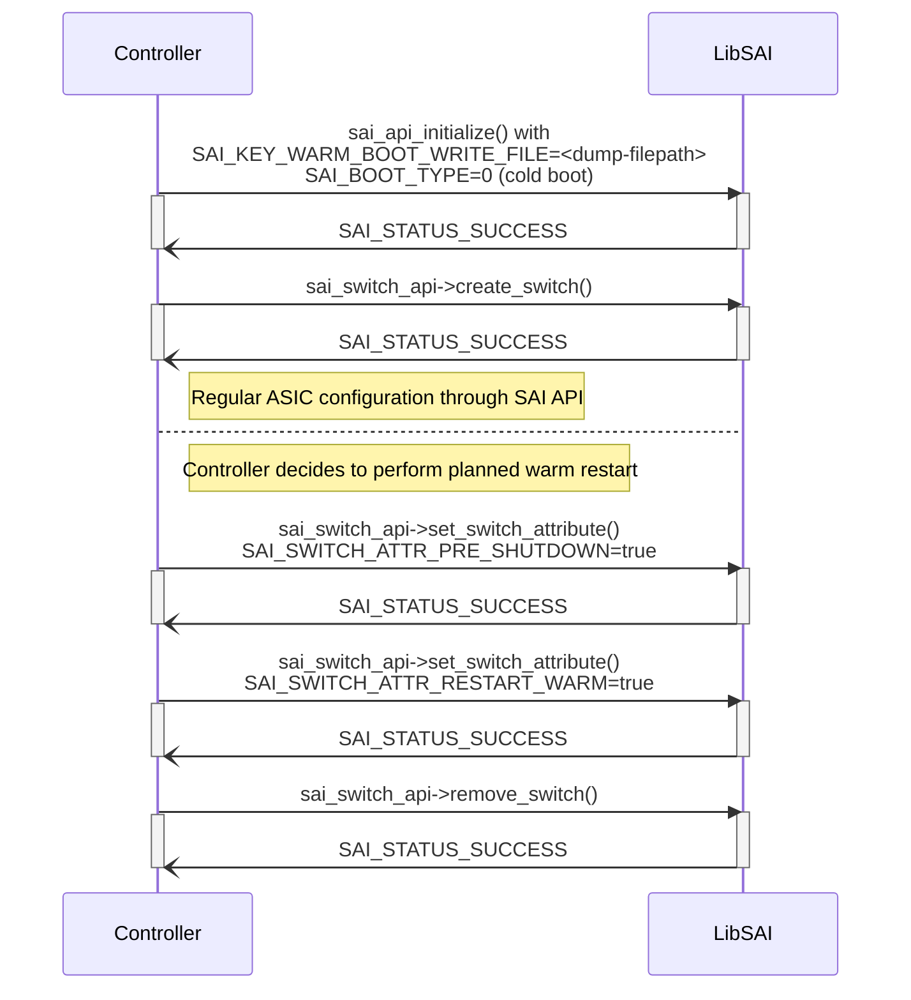

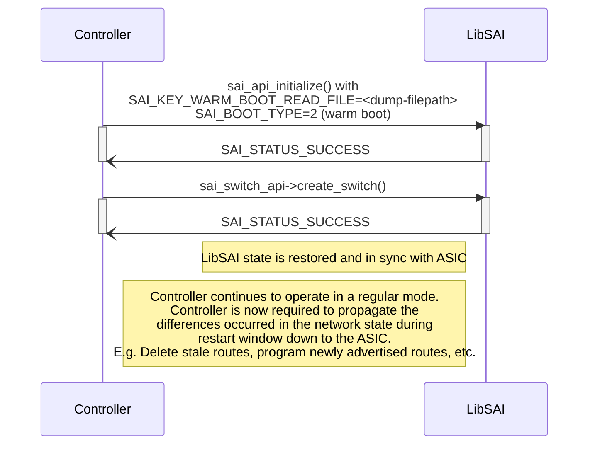

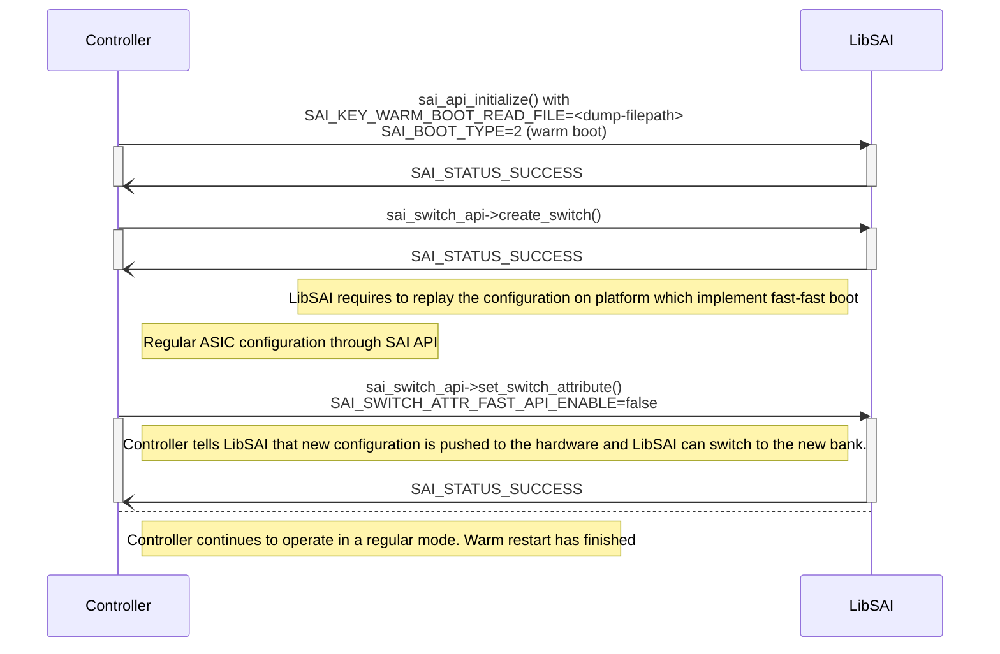

## Linux Restart

Linux already supports warm reboot by *kexec* kernel feature.

*kexec*, abbreviated from kernel execute and analogous to the Unix/Linux kernel call exec, is a mechanism of the Linux kernel that allows booting of a new kernel from the currently running one.
Essentially, kexec skips the bootloader stage and hardware initialization phase performed by the system firmware (BIOS or UEFI), and directly loads the new kernel into main memory and starts
executing it immediately. This avoids the long times associated with a full reboot, and can help systems to meet high-availability requirements by minimizing downtime.

SONiC warm reboot leverages *kexec* Linux kernel functionality to perform warm reboot.

SONiC additionally appends an additional kernel parameter *SONIC_BOOT_TYPE* so that in the *new-life* the software knows that the warm reboot was done and act respectively.

Example how SONiC loads and runs new kernel:

```bash
BOOT_OPTIONS += "SONIC_BOOT_TYPE=warm"
# Load new kernel
/sbin/kexec -l "$KERNEL_IMAGE" --initrd="$INITRD" --append="$BOOT_OPTIONS"
# Execute the actual reboot
/sbin/kexec -e
```

## Persistent Location

A lot of components will require to save a dump of the state into a persistent location. In SONiC this location is */host/warmboot/* directory.
This location does not only persist across SONiC restarts but also persists across SONiC upgrades allowing the new SONiC image version to warm boot
from a dump saved by the old SONiC image version.

## Application warm restart state machine

The state machine is described as follows:

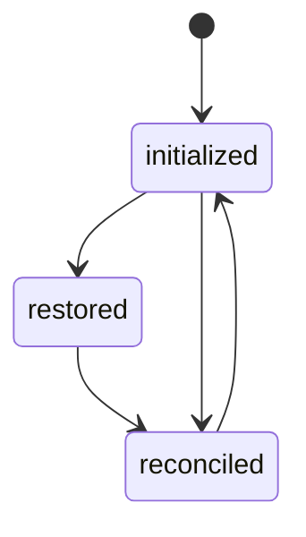

At start of the warm boot procedure most of the daemons set their state to *initialized*.

Once the application has read its configuration and pre-boot state previously uploaded to the database its state transitions into *restored*.

Once the *new-life* state is compared with the *old-life* state and the differences are reprogrammed on the lower layers its state transitions into *reconciled*
and the warm-restart job of this application is formally done, the application continues to operate in a normal way.

Once, the warm restart is executed again, the state transition *reconciled* -> *initialized* happens and the flow repeats.

Some application skip *restored* state and directly transitions into *reconciled* state from *initialized*.

## Application warm restart configuration and state

### WARM_RESTART_ENABLE_TABLE

In order for all the other services to understand that the system is in transient state performing warm restart a special configuration table exists in CFG DB
named *WARM_RESTART_ENABLE_TABLE*:

```abnf
;Stores system warm start and feature warm start enable/disable configuration
key                 = WARM_RESTART_ENABLE_TABLE:name ; name is the name of SONiC feature or "system" for global configuration.

enable              = "true" / "false"  ; Default value as false.
                                        ; If "system" warm start knob is true, docker level knob will be ignored.
                                        ; If "system" warm start knob is false, docker level knob takes effect.
```

The warm boot aware daemons are reading the CFG DB table and understand wether they are in a warm start process by looking at either the name of the feature they are part of or "system" key in *WARM_RESTART_ENABLE_TABLE*.

### WARM_RESTART_TABLE

They are recording the state of the warm start procedure in the STATE DB table called *WARM_RESTART_TABLE*:

```abnf
;Stores application warm start status, persistent across warm reboots.
key             = WARM_RESTART_TABLE|process_name         ; process_name is a unique process identifier.
                                                          ; with exception of 'warm-shutdown' operation.
                                                          ; 'warm-shutdown' operation key is used to
                                                          ; track warm shutdown stages and results.
                                                          ; Added to this table to leverage the existing
                                                          ; "show warm-restart state" command.

restore_count   = 1*10DIGIT                               ; a value between 0 and 2147483647 to keep track
                                                          ; of the number of times that an application has
                                                          ; 'restored' its state from its associated redis
                                                          ; data-store; which is equivalent to the number
                                                          ; of times an application has iterated through
                                                          ; a warm-restart cycle.

state           = "initialized" / "restored" / "reconciled"  ; initialized: initial FSM state for processes
                                                             ; with warm-restart capabilities turned on.
                                                             ;
                                                             ; restored: process restored the state previously
                                                             ; uploaded to redis data-stores.
                                                             ;
                                                             ; reconciled: process reconciled 'old' and 'new'
                                                             ; state collected in 'restored' phase. Examples:
                                                             ; dynanic data like port state, neighbor, routes
                                                             ; and so on.
```

## Database

Database is a crucial component of the SONiC switch software. It does not support warm restarting individually, only together with all other SONiC services.
Database is the first service that starts in SONiC boot process. It requires to distinguish between different boot types and act respectively.

On shutdown phase the dump of the database is performed and the dump is saved into a persistent location:

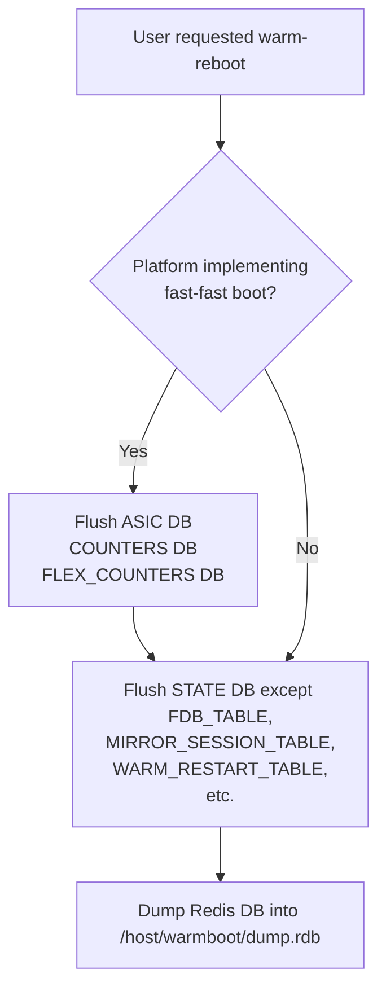

In **fast-fast** boot scenario the ASIC DB is flushed since we are going to reprogram the a non active bank in the ASIC as well as some of the counters are not persistent across reboots
and will be recreated, like flow counters, ACL counters, etc., while other counters will be just repopulated after system starts, like port counters.

For both types of hardware implementations of warm reboot, most of the content of STATE DB is flushed except of few tables which are used to correctly restore the state after reboot.
What kind of tables are dumped from the STATE DB depends on the application and its restoration logic. For example:
- orchagent requires to know the pre-boot mirror session state (whether active or not) to understand whether to program the mirror session on the hardware or not
- WARM_RESTART_TABLE has to be persistent by its definition.

The boot up sequence looks like this:

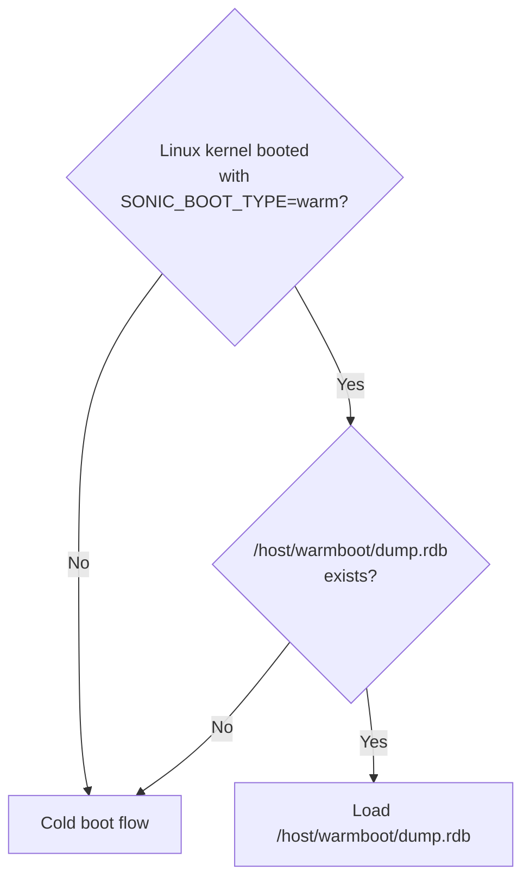

## SYNCD

Syncd determines the reboot cause and the reboot type using the following logic:


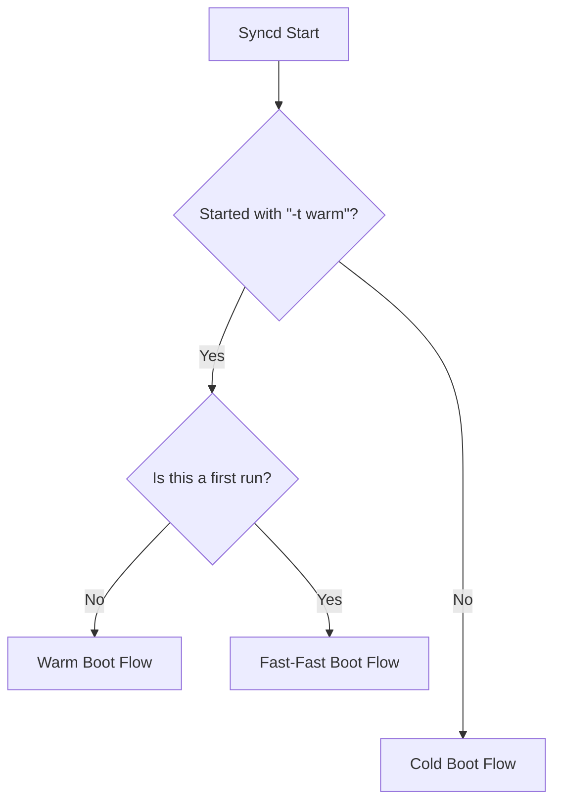

### SYNCD Views on Warm Boot Flow

Essentially there are two views created for warm restart. The current view represents the ASIC state before shutdown, temp view represents the new intended ASIC state after restart.
Based on the SAI object data model, each view is a directed acyclic graph, all objects are linked together.

### SYNCD View Comparison Logic

### SYNCD Views on Fast Fast Boot Flow

### SYNCD system flow

## SWSS

### Orchagent

Orchagent is a key piece of software between upper layer protocols and LibSAI/ASIC. It translates the configuration in APP DB and partially CFG DB into SAIRedis API calls which are then
sent to syncd daemon and translated to actual SAI calls.

The main idea of orchagent warm-reboot is to configure syncd to switch into INIT view mode and replay all the configuration from APP DB, CFG DB into ASIC DB. Once all configuration is done,
orchagent configures syncd to switch into APPLY view mode.

### Orchagent system flow

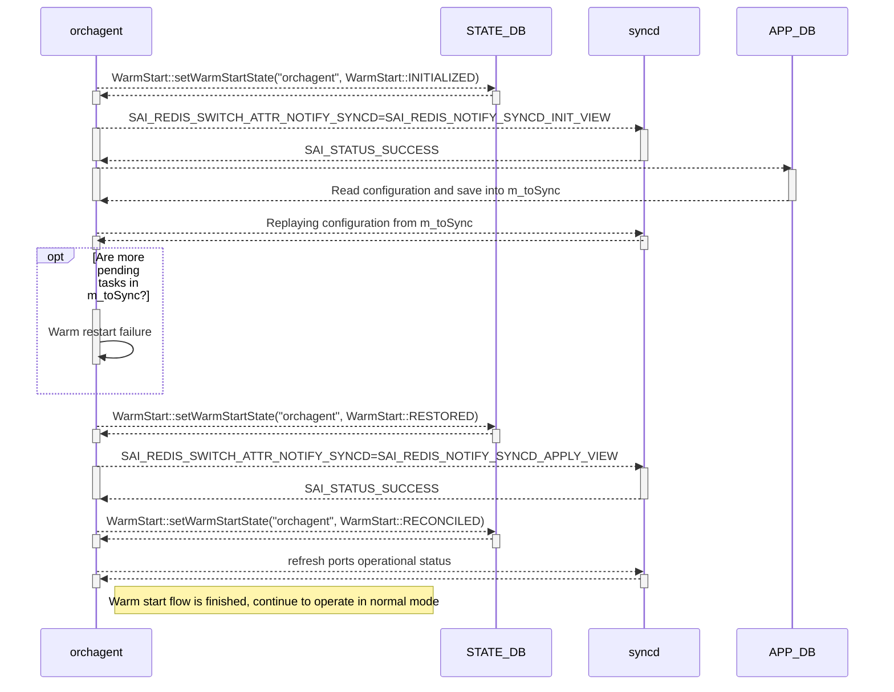


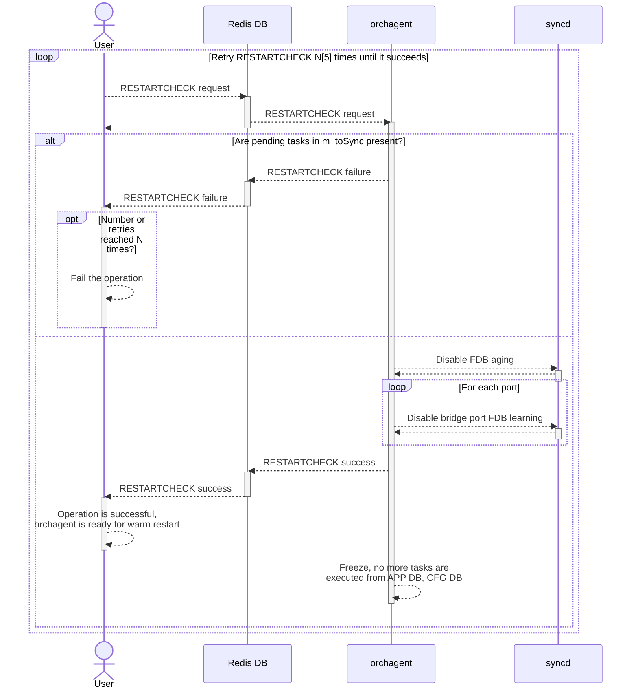

### Neighbor reconciliation flow

Neighbors configuration is a crucial part of the L3 switch software. It is best when the neighbor configuration on the hardware is in sync with the actual switch neighbors on the network.
It can't be assumed that neighbors won't change during warm restart window, while the software is restarting, the SONiC switch software has to be ready for scenarios in which during the restart window:
- Existing neighbors went down, e.g: VMs crashed on the server connected to ToR switch which undergoes warm-reboot.
- New neighbors appeared on the network, e.g: VMs created on the server connected to ToR switch which undergoes warm-reboot.
- MAC changes, e.g: VMs re-created or re-configured on the server connected to ToR switch which undergoes warm-reboot.

This is handled by the neighbors reconciliation flow. Three applications are participating in this flow - *orchagent*, *neighsyncd* and *restore_neighbors.py* script.

During the restoration process, all known pre-boot neighbors are programmed to the Linux Kernel as STALE neighbors and an ARP or NDP packet is sent depending on whether the neighbors is IPv4 or IPv6 neighbor.
This is done by the process called restore_neighbors.py which is part of swss.
This process is repeated from few times until the neighsyncd_timer expires, which by default is set to 110 sec. It is required to continuously repeat the process since some *host* interfaces might not be created
yet or not yet operationally up. In case the neighbor is alive it will reply with a valid ARP/NDP with up-to-date MAC address and the Linux Kernel itself will mark the neighbor as REACHABLE.
Once timer expires, restore_neighbors.py set a flag to STATE DB table called NEIGH_RESTORE_TABLE field "restored" with value "true".

In the meantime, the neighsyncd process is waiting for the "restored" flag to be set to "true" by the restore_neighbors.py script and starts the reconciliation process, which performs the difference between
Linux Kernel neighbors (*new-life* state) and APP DB neighbors (*old-life* state) and pushes the difference to APP DB:
- New neighbors are set to APP DB
- Existing neighbors whose MAC has changed are set to APP DB with the new MAC
- Stale entries are removed from the APP DB

Once that is done, orchagent will apply the changes down to SAIRedis, syncd and SAI.

The below flow illustrates the point.

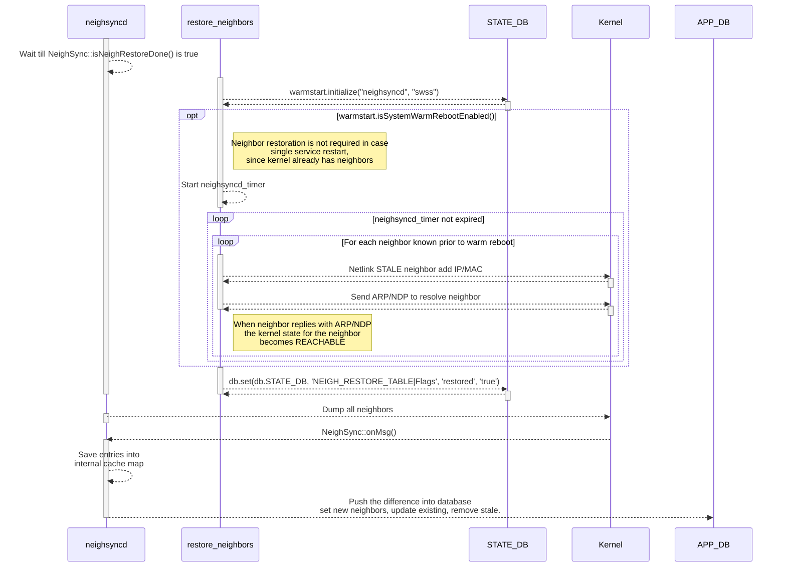

## Teamd

Teamd user space process implements the LACP protocol. LACP is fully supported by SONiC including the warm-reboot functionality.
The upstream teamd implementation, unfortunately, does not implement warm restart capabilities, so SONiC has patches which implement
the required teamd changes to support SONiC warm-reboot.

Teamd has been extended to support starting in warm mode with the addition of '-w' and '-L' command line options:

| Short option | Long option | Description |
|--------------|-------------|-------------|
| -w           | --warm-start | Start in warm mode |
| -L           | --lacp-directory | Directory for saved LACP PDU packets |

To implement the shutdown process teamd handles SIGUSR1 signal as the indication of the start of warm shutdown.

Teamd warm restart only works in case LACP slow mode is configured. In slow LACP mode, we have 90 sec (3 * 30s LACP slow period)
to start again otherwise the peer will reset the LAG causing disruption of traffic. So, *fast* LACP mode is not supported for warm restart.

### Teamd warm restart flow

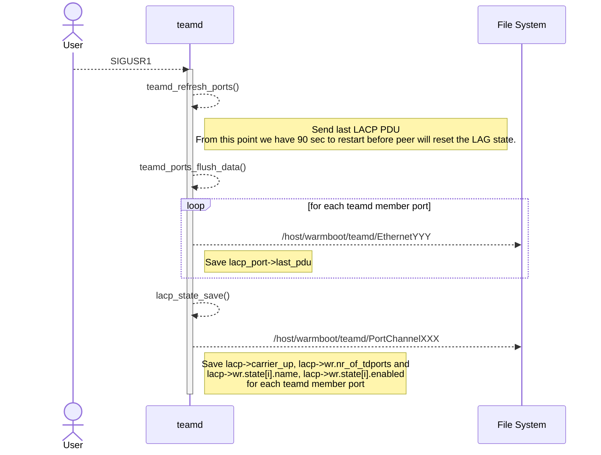

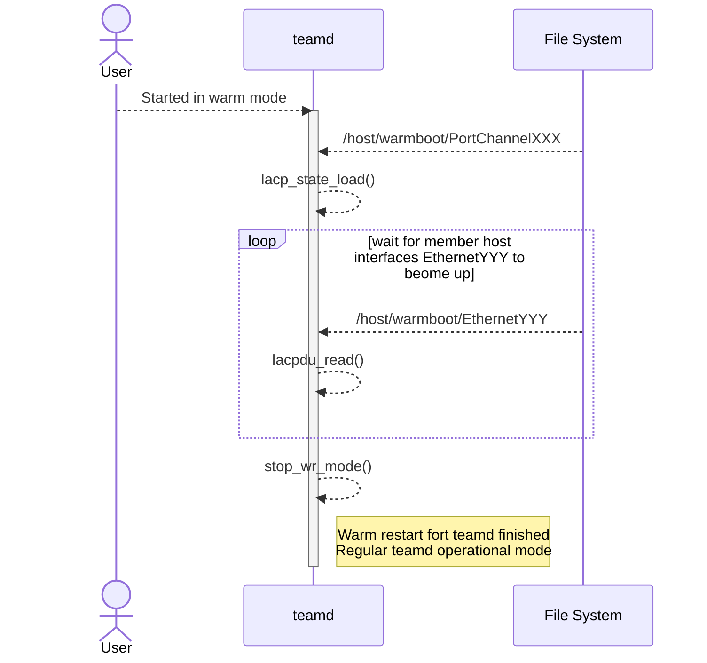


### Teamd reconciliation flow

During the warm restart window the peer of the LAG can go down or one of peers LAG members may go down. The network state must be reconciled with the state of the ASIC.
In this process the *teamsyncd* and *teammgrd* processes are involved is involved.

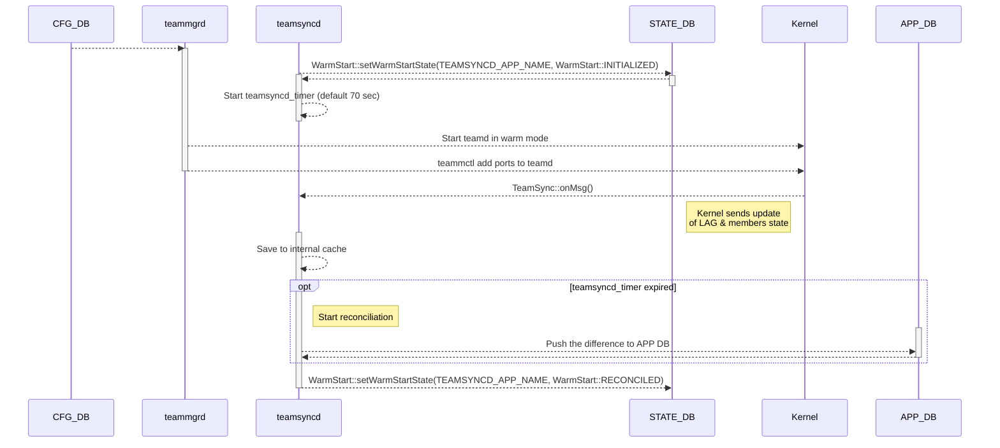

## BGP

FRR suite supports Graceful Restart and EOR capabilities:
- https://datatracker.ietf.org/doc/html/rfc4724

When BGP on a router restarts, all the BGP peers detect that
the session went down and then came up.  This "down/up" transition
results in a "routing flap" and causes BGP route re-computation,
generation of BGP routing updates, and unnecessary churn to the
forwarding tables.

BGP capability, termed "Graceful Restart Capability", is defined that would allow a BGP speaker to express its
ability to preserve forwarding state during BGP restart.

An UPDATE message with no reachable Network Layer Reachability
Information (NLRI) and empty withdrawn NLRI is specified as the End-
of-RIB marker that can be used by a BGP speaker to indicate to its
peer the completion of the initial routing update after the session
is established. 

```
 bgp graceful-restart
 bgp graceful-restart restart-time 240
 bgp graceful-restart select-defer-time 45
 bgp graceful-restart preserve-fw-state
```

These settings are only configured in FRR when DEVICE_METADATA field "type" is set to "ToRRouter".

### FPM sync daemon reconciliation flow

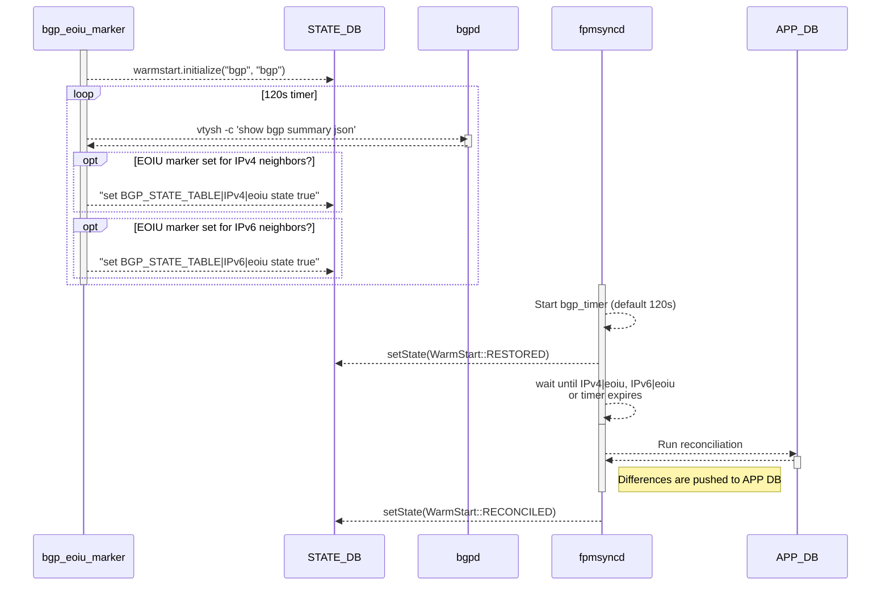

## Management plane containers

Management plane services, including:
- telemetry
- snmp
- management framework

And more, are delayed by the systemd timer by 3m and 30 seconds since Linux kernel boot. This time is enough for critical services to start first.
The main idea behind delaying these services is mostly to free CPU time for more important services at boot.

## ARP/NDP helper

## Warm Boot finalizer

## System flow
